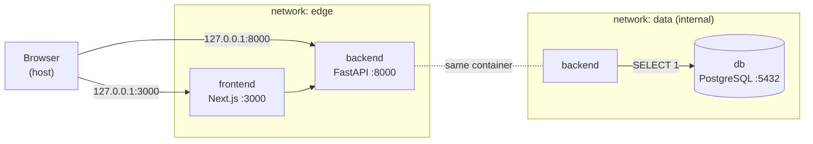
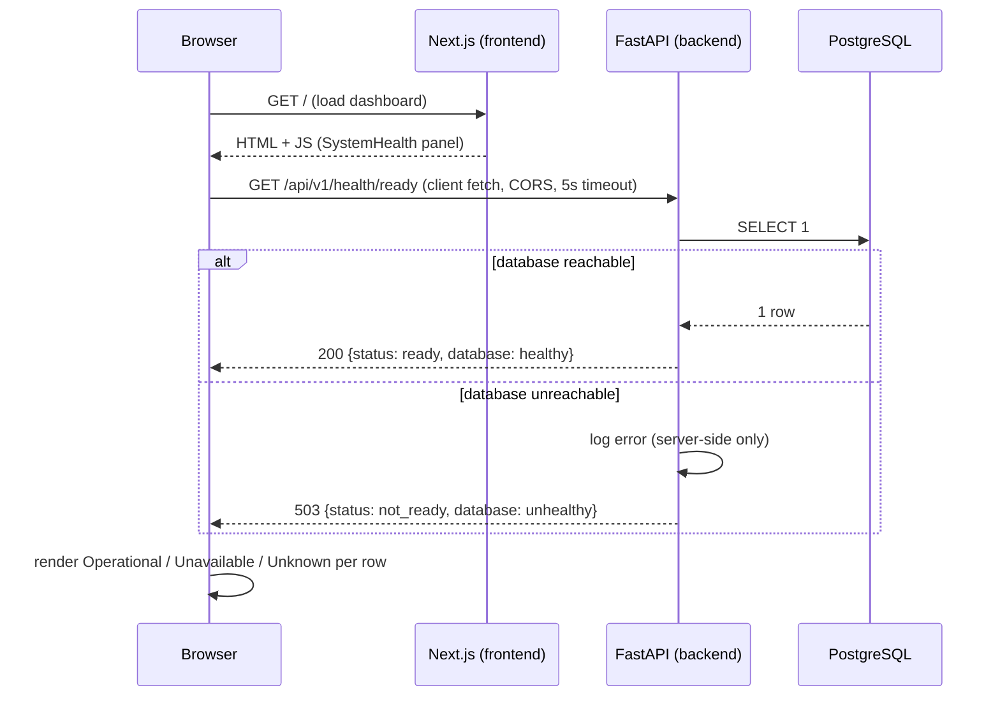
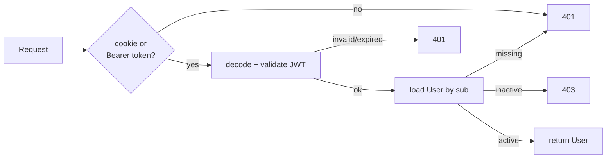

# InfraGuard AI - Architecture

> Updated as phases land. **Not production-ready.**
>
> * **v0.1 - Project Bootstrap:** monorepo, health probes, segmented + hardened
>   Docker, dependency locking, CI. (Sections 1-11.)
> * **v0.2 - Authentication & Identity:** the `User` entity, register / login /
>   logout / `me`, Argon2id, JWT-in-HttpOnly-cookie. (Section 12.)
> * **v0.3 - UI Foundation:** design tokens, theme toggle, i18n (es/en), app
>   shell. (Section 3.)
> * **Assets - Infrastructure Inventory:** the `Asset` entity, authenticated
>   `/api/v1/assets` CRUD + search + filters + pagination, soft deactivation, and
>   the `/assets` frontend module. (Section 13.)

## 1. Project purpose

InfraGuard AI is an AI-powered infrastructure intelligence and incident
management platform. The long-term vision covers infrastructure asset
management, service and dependency modelling, incident management, health
monitoring, impact analysis, AI-assisted incident analysis, dependency graphs,
lifecycle and obsolescence management, and operational dashboards.

**v0.1 delivers none of that domain functionality.** It delivers a clean,
secure, reproducible foundation: a monorepo, a running frontend, a running
backend with real liveness/readiness probes, a containerised PostgreSQL,
dependency locking, container hardening, and CI that builds and smoke-tests
the stack.

## 2. Monorepo decision

A single repository holds the frontend, backend and infrastructure concerns.

**Why:** at this stage the services evolve together, share one environment
contract (`.env.example`), and are deployed as one local stack. A monorepo keeps
a single source of truth, atomic cross-cutting changes, and one place to reason
about security. Each concern is isolated in its own top-level directory with its
own build, dependencies and Dockerfile, so extraction later is cheap.

```
infraguard-ai/
├── frontend/     Next.js (App Router, TypeScript, Tailwind) + Vitest
├── backend/      FastAPI (Python 3.13, SQLAlchemy, Alembic) + hash-pinned locks
├── infra/        Placeholder for future IaC (k8s, Helm)
├── docs/         Architecture and design docs
├── .github/      CI: lint + tests + Docker smoke test
├── docker-compose.yml
├── .env.example
└── ...
```

## 3. Frontend architecture

- **Next.js App Router** with strict TypeScript (`strict`, `noUncheckedIndexedAccess`).
- **Tailwind CSS 3** for styling, driven by **semantic CSS-variable tokens**.
- **pnpm** (pinned via `packageManager: pnpm@11.24.0`).
- **ESLint 9 flat config** (`eslint.config.mjs`, run as `eslint .` - not the
  deprecated `next lint`).
- **Vitest + Testing Library** for behavior-focused unit tests.

```
frontend/src/
├── app/          Routes (/ · /login · /register · /dashboard · /healthz), layout, global styles
├── components/
│   ├── ui/       Internal design system (Button, Input, Card, Badge, Alert, PageHeader, Spinner, EmptyState, Reveal)
│   ├── theme/    ThemeProvider (next-themes) + ThemeToggle (single contextual button)
│   ├── shell/    Authenticated app shell (Sidebar, SidebarFooter, Topbar, MobileNav, NavList, LogoutButton)
│   ├── auth/     AuthLayout (single centered card)
│   └── ...       AuthProvider, RequireAuth, AuthForm, SystemHealth, LanguageSwitcher
├── i18n/         LanguageProvider + useTranslation(); translations/{es,en}.ts (es is the source of truth)
├── lib/          Client config, validation, navigation model, cn() util
├── services/     API access layer (never throws) + tests
└── types/        Shared types + runtime type guards + tests
```

### UI foundation, theming & i18n (v0.3)

- **i18n:** a dependency-free layer in `src/i18n/`. **Spanish is the default**,
  English is the alternative. `LanguageProvider` / `useTranslation()` expose
  `t(key, vars?)` with type-checked dot-path keys, `{var}` interpolation, and an
  active-language → Spanish → key fallback chain. `en.ts` is typed against the
  shape of `es.ts`, so a missing translation is a compile error. Server + first
  client render use Spanish; a persisted choice (`localStorage`,
  `infraguard.language` - non-sensitive) is applied after mount, and `<html
  lang>` is kept in sync. Descriptive copy - auth content, forms, validation,
  dashboard descriptions, account labels, system health, guards, errors, a11y
  labels - goes through `t()`. **Product/module proper nouns stay English in
  every locale**: `InfraGuard AI`, the sidebar nav labels (`Dashboard` /
  `Assets` / `Incidents` / `AI Assistant` / `Settings`), the `Dashboard` page
  heading, the dashboard module names, and the `Coming soon` marker - these are
  literals, not translation keys. `<LanguageSwitcher />` is a labelled `ES | EN`
  button group.
- **Theme:** `next-themes` (~3.5 KB, zero deps) still provides light / dark /
  system with `localStorage` persistence, OS-preference on first visit, and an
  inline pre-hydration script - **no flash, no mismatch**
  (`<html suppressHydrationWarning>`, `darkMode: "class"`). The stored value is a
  non-sensitive UI preference - **auth data is never in `localStorage`**.
  `<ThemeToggle />` is now a **single contextual button**: it renders the icon of
  the target mode (sun while dark, moon while light) with a matching
  `aria-label`. "System" is no longer exposed in the UI; the first explicit tap
  persists a concrete `light` / `dark` value.
- **Tokens:** `--background / --foreground / --surface / --surface-elevated /
  --border / --muted(-foreground) / --primary(-hover/-foreground) / --success /
  --warning / --danger / --ring` defined for `:root` and `.dark` in
  `globals.css`, mapped to Tailwind utilities in `tailwind.config.ts`.
  Components reference tokens only - no scattered hex.
- **Motion:** a small reusable system - entrance keyframes (`fade-in`,
  `fade-in-up`, `scale-in`, `slide-in-left`, 150-260ms) in `tailwind.config.ts`
  and a `<Reveal>` primitive for staggered section entrances. Interaction stays
  hover/focus colour + small transforms. All gated by `motion-safe:` /
  `motion-reduce:` and the global `prefers-reduced-motion` rule. No animation
  library.
- **App shell:** `AppShell` = desktop sidebar / mobile portalled drawer. The
  **sidebar** owns navigation plus a footer with the language switcher, theme
  toggle, signed-in identity and a **confirmation-gated `LogoutButton`** (a first
  tap arms an explicit Confirm / Cancel; state clears only on
  `logout() → { ok: true }`). The `Topbar` is now mobile-only (drawer trigger +
  brand); the drawer repeats the sidebar footer controls. Only **Dashboard** is
  a real route; Assets / Incidents / AI Assistant / Settings show as disabled
  "Coming soon".
- **Auth screens:** `AuthLayout` is a **single self-contained centered card** at
  every width, on a restrained backdrop (faint primary glow + masked grid).
  There is no page-level header; a compact in-card row holds the `InfraGuard AI`
  brand (left) and the language switcher + theme toggle (right), above the form.
  `AuthForm` keeps a show/hide-password control, `autocomplete` attributes,
  field-linked errors (translated from stable validation codes) and a brief
  success confirmation before navigation. **No authentication behaviour
  changed** - same `AuthForm` submit path, same `onSubmit` / `onSuccess`
  contract, same HttpOnly-cookie flow.
- **Responsive:** mobile-first; `html, body { overflow-x: hidden }` guard;
  verified 360-1440px with no horizontal overflow.

The landing/dashboard page shows the platform name, tagline, and a **System
health** panel with three rows: Frontend, Backend API, PostgreSQL Database.

- **Frontend** is reported operational because the page rendered in the browser.
- **Backend API** and **PostgreSQL Database** status come *only* from calling the
  backend **readiness** endpoint (`GET /api/v1/health/ready`) - never hardcoded.
- The service layer never throws: timeout, connection failure, unexpected HTTP
  status, non-JSON body and unexpected JSON shape each map to an explicit UI
  state (loading / operational / unavailable / unknown). A **Refresh** button
  re-queries. All of this is covered by Vitest tests.
- Only `NEXT_PUBLIC_API_URL` is read on the client. No secret is exposed through
  a `NEXT_PUBLIC_*` variable.

## 4. Backend architecture

- **FastAPI** + **Pydantic v2**, **SQLAlchemy 2** (sync engine), **Alembic**.
- **Python 3.13**, typed where it adds value.
- Layered structure:

```
backend/app/
├── api/v1/        HTTP layer, versioned under /api/v1
│   └── routes/    One module per resource (health)
├── core/          config.py - single Settings object (pydantic-settings)
├── db/            engine + SessionLocal + DeclarativeBase
├── models/        ORM models (empty in v0.1)
├── schemas/       Pydantic response models (Liveness / Readiness / Health)
└── services/      Domain logic (health checks)
```

### API

| Method | Path | Description | Codes |
| --- | --- | --- | --- |
| `GET` | `/api/v1/health/live` | Liveness - process is up. No DB access. | `200` |
| `GET` | `/api/v1/health/ready` | Readiness - live `SELECT 1`. | `200` / `503` |
| `GET` | `/api/v1/health` | Summarized status (`healthy`/`degraded`). Compatibility alias. | `200` / `503` |
| `POST` | `/api/v1/auth/register` | Create an account (v0.2). | `201` / `409` / `422` / `429` |
| `POST` | `/api/v1/auth/login` | Authenticate; sets the HttpOnly cookie (v0.2). | `200` / `401` / `429` |
| `POST` | `/api/v1/auth/logout` | Clear the auth cookie (v0.2). | `200` |
| `GET` | `/api/v1/auth/me` | Authenticated user's public profile (v0.2). | `200` / `401` / `403` |
| `GET` | `/docs`, `/openapi.json` | Swagger UI / OpenAPI schema | `200` |
| `GET` | `/` | Minimal service metadata | `200` |

`GET /api/v1/health/ready` returns:

```json
{ "status": "ready", "service": "infraguard-api", "database": "healthy" }
```

- HTTP **200** when the database round-trips a `SELECT 1`.
- HTTP **503** with `{"status": "not_ready", "database": "unhealthy"}` when it
  does not. Connection errors are logged server-side only; the response carries
  no stack trace, connection string or credentials.
- The `503` response is documented in OpenAPI with the **same** schema as `200`.

### `.env` resolution

`app/core/config.py` resolves `.env` by **absolute path** - the repository root
first, then `backend/.env` - never relative to the current working directory.
`cd backend && uvicorn ...` and running from the repo root behave identically.
Explicit environment variables always take precedence over `.env`
(init args > environment > `.env` > defaults). Docker injects plain environment
variables, so no `.env` file is present in (or needed by) any image.

`extra="forbid"` is intentionally **not** used: the repo-root `.env` is shared
with the frontend and container runtimes inject unrelated variables. Unknown
keys are ignored; safety is enforced by targeted validators instead.

### Production fail-safety

When `ENVIRONMENT=production`, `Settings` refuses to build (raises
`ConfigurationError`, no secrets in the message) if:

- the DB password is a well-known placeholder/default, or < 12 chars;
- the DB user is a placeholder/default (when the URL is assembled from parts);
- `BACKEND_CORS_ORIGINS` contains `*`, or is empty.

Development and test environments keep the convenient placeholder defaults.

## 5. PostgreSQL role

PostgreSQL is the platform's relational store. It runs **only** as a Docker
container (never installed on the host), on an **internal** network with no host
port and no outbound internet route. The backend uses a bounded connection pool
(`pool_pre_ping=True`, connect timeout). The schema contains two tables: `users`
(v0.2, migration `02c49f7b5787`) and `assets` (migration `7f3a9c2b1e84`, see
section 13). Each ORM model is registered on `Base.metadata` via
`app/db/registry.py`, which Alembic and the integration test fixtures import.

### Migrations

`alembic/env.py` imports `app.core.config` and `app.db.base:Base`, so the
database URL and metadata come from the one central place - credentials are
never copied into Alembic files.

```bash
alembic revision --autogenerate -m "add <table>"
alembic upgrade head
# in Docker: docker compose exec backend alembic upgrade head
```

## 6. Docker Compose architecture

### Network segmentation (least privilege)



| Service | Networks | Rationale |
| --- | --- | --- |
| `frontend` | `edge` only | Must reach the backend; **must not** reach PostgreSQL. |
| `backend` | `edge` + `data` | The only bridge between the web tier and the data tier. |
| `db` | `data` only (`internal: true`) | Reachable only by the backend; no route to the internet. |

- `frontend` and `backend` publish ports bound to `127.0.0.1` only.
- `db` publishes **no** host port. Data persists in the `pgdata` named volume.
- Verified: `frontend → db:5432` times out; `backend → db:5432` connects.

### Container hardening (defense in depth)

| Control | frontend | backend | db |
| --- | --- | --- | --- |
| Non-root user | `node` (1000) | `app` (999) | `postgres` |
| `no-new-privileges` | yes | yes | yes |
| `cap_drop: ALL` | yes | yes | yes (then `cap_add` the 5 the entrypoint needs) |
| Read-only root FS | yes | yes | no (PostgreSQL writes widely; data is a volume) |
| `tmpfs` writable paths | `/tmp`, `/app/.next/cache` | `/tmp` | `/tmp`, `/run/postgresql` |

Base images are pinned by **digest**; the readable tag is kept in a comment next
to it. Backend dependencies install from a hash-verified wheelhouse with no
network access at install time.

### Startup ordering

Health-gated `depends_on`:

```
db healthy ──▶ backend starts ──▶ backend LIVE (process up) ──▶ frontend starts
```

The backend container `HEALTHCHECK` is **liveness only**. The frontend therefore
starts as soon as the API process is up - even if PostgreSQL is unavailable -
and reports database degradation in its UI rather than failing to load.

## 7. Request flow



Conceptually:

```
Browser → Next.js → FastAPI → PostgreSQL
```

## 8. Liveness vs readiness

| Probe | Endpoint | Checks | Used by |
| --- | --- | --- | --- |
| **Liveness** | `/api/v1/health/live` | FastAPI process responds. **No** dependencies. | Backend container `HEALTHCHECK`; Compose `depends_on` gate for the frontend; (future) k8s `livenessProbe`. |
| **Readiness** | `/api/v1/health/ready` | Liveness **+** live PostgreSQL `SELECT 1`. | Frontend dashboard; (future) k8s `readinessProbe` / load-balancer gating. |
| **Summary** | `/api/v1/health` | Same as readiness, `healthy`/`degraded` wording. | Backwards compatibility / humans. |

The frontend container has its own liveness route, `GET /healthz`, returning
exactly `200` - it never contacts the backend or the database.

Health-check flow for the dashboard rows:

| Component | How its status is determined |
| --- | --- |
| Frontend | The dashboard rendered in the browser. |
| Backend API | The client's `GET /api/v1/health/ready` returned a well-formed response. |
| PostgreSQL | The `database` field of that response, set by a live `SELECT 1`. |

## 9. Security considerations (v0.1)

| Concern | Handling in v0.1 |
| --- | --- |
| Secrets | Never hardcoded. `.env` git-ignored; only `.env.example` (placeholders) tracked. No secret baked into any image. `JWT_SECRET` never a `NEXT_PUBLIC_*`. PowerShell/OS artifacts git-ignored. |
| Production config | Fail-fast: placeholder/short DB password, default DB user, wildcard CORS, **placeholder/short `JWT_SECRET`**, **insecure auth cookie** are rejected when `ENVIRONMENT=production`. |
| Passwords | Argon2id; never stored in clear, logged, or returned. Generic **login** failure + timing equalisation. **Validation 422s never reflect the submitted value** (`input`/`ctx` stripped). |
| Tokens | Short-lived HS256 JWT in an HttpOnly / SameSite=Lax / Secure-in-prod cookie. No revocation yet (documented). |
| CSRF | SameSite=Lax + `Origin`/`Referer` allowlist on unsafe methods + JSON-preflight + non-wildcard CORS. |
| Caching | Every `/api/v1/auth/*` response (success + error) is `Cache-Control: no-store`, `Pragma: no-cache`. |
| Logout | Client drops session state only on a confirmed `200` - never on network/server failure. |
| Enumeration | `register` returns an explicit `409` for a known email - **accepted v0.2 tradeoff** (see 12.14). `login` stays generic. |
| Rate limiting | Best-effort in-process limiter on `login` / `register` (per-IP). Production needs a shared store. |
| CORS | Restricted to the configured frontend origin. No wildcard. **Credentials enabled** (required for the cookie; safe only with an explicit origin list). |
| Network | Segmented `edge` / `data` (internal) networks; frontend cannot reach the DB; DB has no outbound route. |
| DB exposure | No host port for PostgreSQL. App ports bound to `127.0.0.1`. |
| Error leakage | Health/readiness return generic states; details logged server-side only. `redoc` disabled. |
| Containers | Digest-pinned official base images, slim/alpine, non-root, `no-new-privileges`, `cap_drop: ALL`, read-only root FS (apps), `.dockerignore`, no `.env` copied in. |
| Dependencies | Backend: hash-pinned locks + pinned build tooling, installed offline in Docker. Frontend: `pnpm-lock.yaml`. |
| CI | Minimal `contents: read` token; actions pinned to commit SHAs; builds and smoke-tests the stack. |
| Authorization (RBAC) | **Not implemented yet** - a dedicated later phase. v0.2 is authentication only. |

## 10. Dependency & image reproducibility

- **Backend abstract deps:** `pyproject.toml` (`==` pins). Build backend pinned
  in `[build-system]` (`setuptools`, `wheel`).
- **Backend resolved deps:** `requirements.txt` / `requirements-dev.txt`,
  generated by `pip-compile --generate-hashes`, committed. Every transitive
  dependency is pinned with a SHA-256 hash. Docker builds a wheelhouse with
  `pip wheel --require-hashes` then installs `--no-index` from it.
- **`pip` itself** is pinned in the Dockerfile and CI (no floating upgrade).
- **Frontend:** `pnpm-lock.yaml`; pnpm version pinned via `packageManager`.
- **Base images:** pinned by digest, readable tag in a comment. Update with
  `docker buildx imagetools inspect <image>:<tag>`.
- **GitHub Actions:** pinned to commit SHAs with `# vX.Y.Z` comments.

## 11. CI (v0.1 scope)

`.github/workflows/ci.yml`, triggered on PRs and pushes to `main`:

1. **backend** - install from the hash-pinned lock, `ruff check`, `pytest`.
2. **frontend** - `pnpm install --frozen-lockfile`, `lint`, `typecheck`,
   `test` (Vitest), `build`.
3. **docker-smoke** - `docker compose config`, `build`, `up -d`, wait for backend
   liveness, assert readiness `200`, assert frontend `/healthz` and `/` return
   `200`, dump logs on failure, `docker compose down -v` always.

Token permissions are `contents: read`. Out of scope for v0.1: image publishing,
deployment, Kubernetes, security scanning, release automation.

## 12. Authentication & Identity (v0.2)

### 12.1 Scope

Email + password authentication and the first persistent entity, `User`.
**In scope:** register, login, logout, `GET /auth/me`, a reusable auth
dependency, a client-guarded `/dashboard`. **Out of scope (later phases):**
RBAC / roles / permissions, OAuth, MFA, refresh-token rotation, server-side JWT
revocation, password reset, email verification.

### 12.2 `User` model & migration

`app/models/user.py`:

| Column | Type | Notes |
| --- | --- | --- |
| `id` | `UUID` PK | DB default `gen_random_uuid()`; Python default `uuid4` |
| `email` | `varchar(320)` | `UNIQUE` (`uq_users_email`, index-backed); CHECK `= lower(email)` and non-empty |
| `password_hash` | `varchar(255)` | Argon2id; CHECK non-empty |
| `is_active` | `boolean` | default `true` |
| `created_at` / `updated_at` | `timestamptz` | server default `now()`; `updated_at` `onupdate` |

`Base.metadata` carries a naming convention so constraint names are deterministic
in migrations. The first migration `02c49f7b5787_create_users_table` was
generated from the model, hand-reviewed, and validated on the Docker PostgreSQL
(`upgrade → downgrade -1 → upgrade`). Lifecycle: **model → Alembic → PostgreSQL**;
`docker compose run --rm migrate` applies it (one-shot, never on `up`).

### 12.3 Password hashing

Argon2id via `argon2-cffi` with the library's recommended default parameters -
no hand-picked cryptographic settings. `check_needs_rehash` upgrades stored
hashes on the next successful login. Policy: **12-128 chars**, blank rejected,
never truncated. A dummy Argon2 verify runs when the email is unknown, so login
timing doesn't reveal whether an account exists.

### 12.4 JWT access tokens

HS256, secret from `JWT_SECRET` (config; `>= 32` chars and non-placeholder
enforced in production). Claims: `sub`, `iat`, `nbf`, `exp`, `jti`, `iss`,
`type=access` - no email or password material. Lifetime
`JWT_ACCESS_TOKEN_EXPIRE_MINUTES` (default 15). Decoding validates signature,
issuer, expiry, required claims and token type; `alg=none`, tampered, expired
and malformed tokens are rejected.

### 12.5 Token storage - decision

| Option | XSS exposure | CSRF exposure | Chosen |
| --- | --- | --- | --- |
| `localStorage` | **High** - any injected script can exfiltrate the token | None | ✗ |
| **HttpOnly cookie** | Low - script cannot read it | Needs mitigation | **✓** |

The token is set as `Set-Cookie: infraguard_access=<jwt>; HttpOnly; SameSite=Lax;
Path=/; Max-Age=<ttl>` (+ `Secure` in production). It is **never** in the
response body and **never** readable by JavaScript. The backend also accepts
`Authorization: Bearer` for non-browser clients and tests.

- **XSS:** an injected script still cannot steal the token. It could still call
  the API *as* the user while the page is open - so this is mitigation, not
  immunity; standard output-encoding / CSP hygiene still matters.
- **CSRF:** `SameSite=Lax` stops the cookie riding cross-site non-GET requests;
  a strict `Origin`/`Referer` allowlist check on `POST/PUT/PATCH/DELETE`
  (`require_trusted_origin`) is defense in depth; the JSON content-type also
  forces a CORS preflight that the restrictive policy fails for foreign origins.
  Requests with no `Origin`/`Referer` (non-browser) are allowed.
- **Production cookie:** `Secure` (HTTPS only), `SameSite=Lax` (or `Strict` if
  no cross-site top-level nav is needed), `HttpOnly`, `Path=/`. `SameSite=None`
  is rejected unless `Secure`.

### 12.6 Auth dependency



`get_current_user` (in `app/api/deps.py`) is the single reusable dependency for
every future protected endpoint (`assets`, `incidents`, …).

### 12.7 Request flow

```mermaid
sequenceDiagram
    participant B as Browser (localhost:3000)
    participant N as Next.js (AuthProvider)
    participant F as FastAPI (localhost:8000)
    participant P as PostgreSQL

    N->>F: GET /api/v1/auth/me  (credentials: include)
    F-->>N: 401  → status "unauthenticated"
    B->>N: submit /login form
    N->>F: POST /api/v1/auth/login {email, password}  (Origin checked)
    F->>P: SELECT user WHERE email=?
    F->>F: Argon2 verify · issue JWT
    F-->>N: 200 {user}  + Set-Cookie: infraguard_access (HttpOnly)
    N->>F: GET /api/v1/auth/me  (cookie auto-sent)
    F-->>N: 200 {user}  → status "authenticated"
    B->>N: navigate /dashboard  (RequireAuth renders)
    B->>N: click "Log out"
    N->>F: POST /api/v1/auth/logout
    F-->>N: 200  + Set-Cookie: infraguard_access=; Max-Age=0
```

### 12.8 Frontend

`AuthProvider` (React context) calls `/auth/me` on mount and exposes
`{user, status, error, login, register, logout, refresh}`. `RequireAuth` gates
`/dashboard` **client-side** (the API is the source of truth): it shows a brief
"Checking your session…" state, then renders children or `router.replace("/login")`.
Server-side gating would need the frontend and API to be same-origin (a reverse
proxy) - a deployment concern. All auth `fetch` calls use `credentials: "include"`,
never throw, and map every failure (`401` / `409` / `422` / `429` / offline /
malformed) to a typed result the UI renders explicitly.

**Logout is confirmation-gated.** `authService.logout()` returns a structured
`LogoutResult`; `AuthProvider` drops authenticated state **only** on a confirmed
`200`. If the request fails (network or non-200), the HttpOnly cookie may still
be valid, so the session stays `authenticated` and the UI shows *"you are still
signed in - please try again"*. This avoids a UI that looks logged out while the
token is live.

### 12.9 Validation error sanitization

Pydantic's default `422` body echoes the submitted value in an `input` field -
for a password field that is the **plaintext password**. A custom
`RequestValidationError` handler (`app/api/errors.py`) returns only
`{type, loc, msg}` per error - `input` and `ctx` are stripped. The frontend's
per-field messages (`detail[].loc` / `detail[].msg`) still work. Regression
tests assert sentinel passwords never appear in any response body.

### 12.10 Cache headers

Every response under `/api/v1/auth` (success **and** error) is served
`Cache-Control: no-store` + `Pragma: no-cache` via a path-scoped middleware, so
credentials and profile data are never cached by browsers or intermediaries.

### 12.12 CORS

`allow_credentials=True` is now required for the cookie. It is only safe because
`allow_origins` is an explicit list (never `*` - enforced by config in
production), `allow_methods` / `allow_headers` are explicit, and credentials are
never combined with a wildcard. Local dev: `http://localhost:3000` →
`http://localhost:8000` (same site, different port) works with `SameSite=Lax`.

### 12.13 Rate limiting - decision

A small **in-process fixed-window limiter** (`app/core/ratelimit.py`) guards
`login` and `register` per client IP. No Redis, no new infrastructure. It is
honest about its limits: **per-process, lost on restart, not shared across
replicas**. With one backend replica it still slows brute force from one source.
**Production** must enforce rate limiting at a shared layer (Redis-backed
limiter, API gateway, or WAF) - deferred to the security-hardening phase.

### 12.14 Known limitations (v0.2)

- **No JWT revocation.** Logout clears the cookie *and* is confirmation-gated on
  the client, but an already-issued token stays cryptographically valid until
  `exp` (≤ 15 min). Next step: a `jti` denylist, or short access + refresh-token
  rotation.
- **Duplicate-registration enumeration (accepted tradeoff).** `POST /auth/register`
  returns an explicit `409 "Email is already registered"`, which lets an attacker
  learn whether an email has an account. Kept deliberately for portfolio
  usability - registration is **not** redesigned. Rate limiting blunts bulk
  enumeration. A production deployment would instead return a generic
  "check your email" response and confirm/deny out of band.
- **`JWT_SECRET` is a single static HS256 key.** Rotation / a KMS-managed or
  asymmetric (RS256/EdDSA) key is a deployment concern.
- **Rate limiter is per-process** (see 12.13).
- **Protected routing is client-side** (see 12.8).
- Password strength is length-only (no breached-password check - deferred).

## 13. Assets - Infrastructure Inventory

### 13.1 Scope

The first business-domain module: a flat inventory of infrastructure items.
**In scope:** list (paginated / searchable / filterable), detail, create, partial
update, soft deactivate / reactivate - all authenticated. **Out of scope (later
phases):** dependency graphs / Neo4j, incidents, AI analysis, health telemetry,
obsolescence, per-asset authorization.

### 13.2 `Asset` model & migration

`app/models/asset.py` (table `assets`, migration `7f3a9c2b1e84`, `down_revision`
= the users migration):

| Column | Type | Notes |
| --- | --- | --- |
| `id` | `UUID` PK | DB default `gen_random_uuid()` |
| `name` | `varchar(200)` | required; CHECK non-empty |
| `asset_type` | `varchar(40)` | required; CHECK ∈ {Server, Virtual Machine, Database, Application, Network Device, Container, Kubernetes Cluster, Cloud Resource} |
| `environment` | `varchar(20)` | required; CHECK ∈ {Production, Staging, Development, Test} |
| `criticality` | `varchar(10)` | required; CHECK ∈ {Critical, High, Medium, Low} |
| `status` | `varchar(20)` | required; CHECK ∈ {Operational, Degraded, Maintenance, Offline} |
| `hostname` | `varchar(253)` | optional |
| `ip_address` | `varchar(45)` | optional; validated as IPv4/IPv6 by the schema, stored normalised |
| `description` | `text` | optional (≤ 2000 chars at the schema) |
| `owner` | `varchar(200)` | optional |
| `is_active` | `boolean` | default `true` - the soft-deactivation flag |
| `created_at` / `updated_at` | `timestamptz` | server default `now()`; `updated_at` `onupdate` |

**Catalog values as `StrEnum` + `CHECK`, not tables or native enums.** The
vocabulary is small and fixed, so a catalog table would be overhead. A native
PostgreSQL `ENUM` would need a migration to extend; a `varchar` + `CHECK` built
from the `StrEnum` is trivially altered later. Values are stored in English
(matching the enum) and translated only for display in the frontend.

**Indexes:** `name`, each filter column (`asset_type`, `environment`,
`criticality`, `status`, `is_active`) and `created_at`. **No UNIQUE
constraint** - the same name legitimately recurs across environments (a
`web-01` in Production and in Staging), and hostname/IP are optional.

Validated on the Docker PostgreSQL: `upgrade → downgrade → upgrade`, and
`alembic check` reports no drift from the model.

### 13.3 API

`app/api/v1/routes/assets.py`, router-level `Depends(get_current_user)` (every
endpoint authenticated); writes also `Depends(require_trusted_origin)`.

| Method | Path | Notes | Codes |
| --- | --- | --- | --- |
| `GET` | `/api/v1/assets` | `page` (≥1), `page_size` (1-100, default 20), `q`, `asset_type`, `environment`, `criticality`, `status`, `is_active` | `200` / `401` / `422` |
| `GET` | `/api/v1/assets/{id}` | | `200` / `401` / `404` |
| `POST` | `/api/v1/assets` | `AssetCreate` (`extra="forbid"`) | `201` / `401` / `403` / `422` |
| `PATCH` | `/api/v1/assets/{id}` | `AssetUpdate` (`extra="forbid"`, no `is_active`) - only sent fields change | `200` / `401` / `403` / `404` / `422` |
| `POST` | `/api/v1/assets/{id}/deactivate` | idempotent; `updated_at` only moves on a real change | `200` / `401` / `403` / `404` |
| `POST` | `/api/v1/assets/{id}/reactivate` | idempotent | `200` / `401` / `403` / `404` |

**Pagination** response: `{ items, page, page_size, total, total_pages }`.
`total_pages = ceil(total / page_size)` (0 when empty). Ordering is
`updated_at DESC, id DESC` for a stable page window. `page_size` is capped so a
client cannot request an unbounded result set.

**Search** (`services/assets.py`) is a case-insensitive `ILIKE '%term%'` over
`name`, `hostname`, `owner` and `ip_address`, built with the SQLAlchemy
expression API. The term's `%` / `_` / `\` are escaped so they match literally.
Contains-search is not index-accelerated yet - a trigram / GIN index is a future
optimisation, noted in the limitations.

### 13.4 Deactivation - decision

There is **no `DELETE`**. Assets carry history and references, so a hard delete
is the wrong default. Lifecycle is a **dedicated pair of POST endpoints**
(`/deactivate`, `/reactivate`) rather than a field on `PATCH`: the intent is
explicit, the calls are idempotent, they are easy to audit later, and `PATCH`
stays purely about content (`AssetUpdate` has no `is_active`, and sending it is
a `422`). A deactivated asset stays fully queryable with `is_active=false`.

### 13.5 Frontend

Routes under `/assets`, all client components wrapped in
`<RequireAuth><AppShell>`:

| Route | Purpose |
| --- | --- |
| `/assets` | list: page title, result count, search (debounced), catalog + state filters, "New asset", responsive table (cards below `lg`), pagination, and explicit loading / empty / filtered-empty / error states. Filter + search + page are reflected in the URL query string (shareable, back/forward friendly); `useSearchParams` is read inside a `<Suspense>` boundary |
| `/assets/new` | `<AssetForm mode="create">` |
| `/assets/[id]` | detail: header (name, type, criticality + status badges), overview, description, actions (Edit link, confirmation-gated Deactivate / Reactivate), and a disabled "dependencies & incidents" placeholder |
| `/assets/[id]/edit` | `<AssetForm mode="edit" initial={asset}>` |

`AssetForm` is the single create/edit component (client validation via
`lib/assetValidation.ts` returning codes the UI translates; server field errors
from a `422` are merged in). The service layer (`services/assets.ts`) never
throws - every outcome (`unreachable` / `unauthorized` / `not_found` /
`validation` / `rate_limited` / `unexpected`) is a typed result the UI renders.

**i18n:** catalog values are English in the data and translated for display via
`components/assets/catalog.ts` (explicit `Record<Value, TranslationKey>` maps).
Criticality / status badges always carry the translated text, so meaning does not
depend on colour. The `Assets` nav label, like all module names, stays English.

### 13.6 Known limitations

- No dependency links, incidents, health checks or obsolescence - later phases.
- Search is `ILIKE '%...%'` with no trigram index (fine at this scale).
- No per-asset ownership / authorization - any authenticated user can edit any
  asset (RBAC is a dedicated future phase).
- No bulk operations, CSV import/export, or audit log.
- No optimistic-concurrency token on `PATCH` (last write wins).

## 14. Future direction

Later, dedicated feature branches are expected to add:

- Authorization / RBAC; refresh tokens + revocation; password reset; email
  verification; OAuth; MFA
- The InfraGuard domain model (assets, services, dependencies, incidents)
- **Neo4j** dependency graph · **AI providers** for incident analysis / RAG
- **Kubernetes** + **Helm**, with Secrets / an external secret manager
- **CI/CD** (security scan, image publish, deploy) · **Observability**

```mermaid
graph LR
    v01["v0.1<br/>Bootstrap"] --> v02["v0.2<br/>Auth & users"]
    v02 --> rbac["Authorization<br/>(RBAC)"]
    rbac --> domain["Domain model<br/>(assets, incidents)"]
    domain --> graph["Neo4j<br/>dependency graph"]
    domain --> ai["AI incident analysis"]
    domain --> k8s["Kubernetes + Helm"]
    k8s --> cicd["CI/CD + scanning"]
    k8s --> obs["Observability"]
```

Each boundary is deliberate: ship a trustworthy layer, then build on it.
