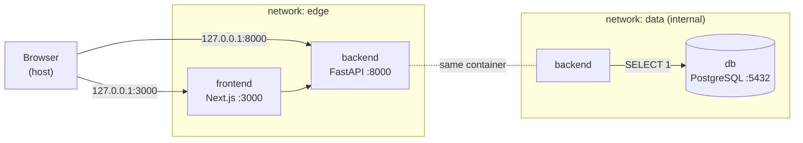
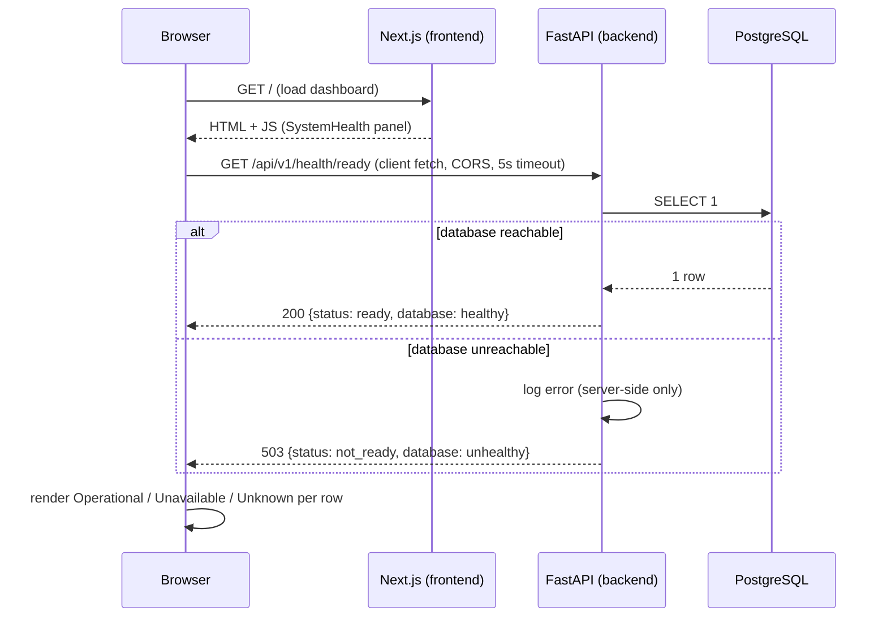
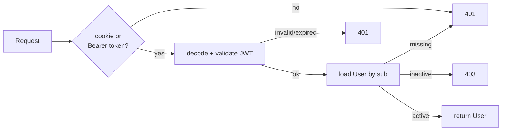

# InfraGuard AI - Architecture

> Updated as phases land. **Not production-ready.**
>
> * **v0.1 - Project Bootstrap:** monorepo, health probes, segmented + hardened
>   Docker, dependency locking, CI. (Sections 1-11.)
> * **v0.2 - Authentication & Identity:** the `User` entity, register / login /
>   logout / `me`, Argon2id, JWT-in-HttpOnly-cookie. (Section 12.)
> * **v0.3 - UI Foundation:** design tokens, theme toggle, i18n (es/en), app
>   shell. (Section 3.)
> * **Assets - Infrastructure Inventory:** the `Asset` entity, authenticated
>   `/api/v1/assets` CRUD + search + filters + pagination, soft deactivation, and
>   the `/assets` frontend module. (Section 13.)
> * **Product Experience:** visual direction, Dashboard, overlay/toast/skeleton
>   foundations, route-aware detail workspaces. (Section 14.)
> * **Incident Management:** the `Incident` entity + persisted timeline +
>   `Incident ↔ Asset` M2M, `/api/v1/incidents`, the `/incidents` module.
>   (Sections 15-16.)
> * **Governance P1 - Audit Log:** append-only `audit_events` / `audit_changes`,
>   route-layer emission, read-only API, the `/audit` activity timeline.
>   (Section 17.)
> * **Governance P2 - Trash / Restore:** `deleted_at` / `deleted_by` soft delete
>   for Assets & Incidents, the dedicated Trash API, the `/trash` recovery
>   module, audit `DELETE` / `RESTORE`. (Section 18a.)
> * **Governance P3 - RBAC & User Administration:** `permissions` / `roles` /
>   `user_roles` / `role_permissions`, a 16-permission catalog, four system roles,
>   backend-enforced `require_permission` guards, the `account_status` lifecycle +
>   access-request approval flow, the explicit `bootstrap_admin` command,
>   last-admin lockout protection, the `/admin` Users / Access-requests / Roles
>   module. (Section 18b.)

## 1. Project purpose

InfraGuard AI is an AI-powered infrastructure intelligence and incident
management platform. The long-term vision covers infrastructure asset
management, service and dependency modelling, incident management, health
monitoring, impact analysis, AI-assisted incident analysis, dependency graphs,
lifecycle and obsolescence management, and operational dashboards.

**v0.1 delivers none of that domain functionality.** It delivers a clean,
secure, reproducible foundation: a monorepo, a running frontend, a running
backend with real liveness/readiness probes, a containerised PostgreSQL,
dependency locking, container hardening, and CI that builds and smoke-tests
the stack.

## 2. Monorepo decision

A single repository holds the frontend, backend and infrastructure concerns.

**Why:** at this stage the services evolve together, share one environment
contract (`.env.example`), and are deployed as one local stack. A monorepo keeps
a single source of truth, atomic cross-cutting changes, and one place to reason
about security. Each concern is isolated in its own top-level directory with its
own build, dependencies and Dockerfile, so extraction later is cheap.

```
infraguard-ai/
├── frontend/     Next.js (App Router, TypeScript, Tailwind) + Vitest
├── backend/      FastAPI (Python 3.13, SQLAlchemy, Alembic) + hash-pinned locks
├── infra/        Placeholder for future IaC (k8s, Helm)
├── docs/         Architecture and design docs
├── .github/      CI: lint + tests + Docker smoke test
├── docker-compose.yml
├── .env.example
└── ...
```

## 3. Frontend architecture

- **Next.js App Router** with strict TypeScript (`strict`, `noUncheckedIndexedAccess`).
- **Tailwind CSS 3** for styling, driven by **semantic CSS-variable tokens**.
- **pnpm** (pinned via `packageManager: pnpm@11.24.0`).
- **ESLint 9 flat config** (`eslint.config.mjs`, run as `eslint .` - not the
  deprecated `next lint`).
- **Vitest + Testing Library** for behavior-focused unit tests.

```
frontend/src/
├── app/          Routes (/ · /login · /register · /dashboard · /healthz), layout, global styles
├── components/
│   ├── ui/       Internal design system (Button, Input, Card, Badge, Alert, PageHeader, Spinner, EmptyState, Reveal)
│   ├── theme/    ThemeProvider (next-themes) + ThemeToggle (single contextual button)
│   ├── shell/    Authenticated app shell (Sidebar, SidebarFooter, Topbar, MobileNav, NavList, LogoutButton)
│   ├── auth/     AuthLayout (single centered card)
│   └── ...       AuthProvider, RequireAuth, AuthForm, SystemHealth, LanguageSwitcher
├── i18n/         LanguageProvider + useTranslation(); translations/{es,en}.ts (es is the source of truth)
├── lib/          Client config, validation, navigation model, cn() util
├── services/     API access layer (never throws) + tests
└── types/        Shared types + runtime type guards + tests
```

### UI foundation, theming & i18n (v0.3)

- **i18n:** a dependency-free layer in `src/i18n/`. **Spanish is the default**,
  English is the alternative. `LanguageProvider` / `useTranslation()` expose
  `t(key, vars?)` with type-checked dot-path keys, `{var}` interpolation, and an
  active-language → Spanish → key fallback chain. `en.ts` is typed against the
  shape of `es.ts`, so a missing translation is a compile error. Server + first
  client render use Spanish; a persisted choice (`localStorage`,
  `infraguard.language` - non-sensitive) is applied after mount, and `<html
  lang>` is kept in sync. Descriptive copy - auth content, forms, validation,
  dashboard descriptions, account labels, system health, guards, errors, a11y
  labels - goes through `t()`. **Product/module proper nouns stay English in
  every locale**: `InfraGuard AI`, the sidebar nav labels (`Dashboard` /
  `Assets` / `Incidents` / `AI Assistant` / `Settings`), the `Dashboard` page
  heading, the dashboard module names, and the `Coming soon` marker - these are
  literals, not translation keys. `<LanguageSwitcher />` is a labelled `ES | EN`
  button group. **(Superseded in §14.2: the switcher and the language preference
  were removed - the visible UI is now Spanish-only.)**
- **Theme:** `next-themes` (~3.5 KB, zero deps) still provides light / dark /
  system with `localStorage` persistence and an inline pre-hydration script -
  **no flash, no mismatch** (see §14.1: **dark** became the first-visit default)
  (`<html suppressHydrationWarning>`, `darkMode: "class"`). The stored value is a
  non-sensitive UI preference - **auth data is never in `localStorage`**.
  `<ThemeToggle />` is now a **single contextual button**: it renders the icon of
  the target mode (sun while dark, moon while light) with a matching
  `aria-label`. "System" is no longer exposed in the UI; the first explicit tap
  persists a concrete `light` / `dark` value.
- **Tokens:** `--background / --foreground / --surface / --surface-elevated /
  --border / --muted(-foreground) / --primary(-hover/-foreground) / --success /
  --warning / --danger / --ring` defined for `:root` and `.dark` in
  `globals.css`, mapped to Tailwind utilities in `tailwind.config.ts`.
  Components reference tokens only - no scattered hex.
- **Motion:** a small reusable system - entrance keyframes (`fade-in`,
  `fade-in-up`, `scale-in`, `slide-in-left`, 150-260ms) in `tailwind.config.ts`
  and a `<Reveal>` primitive for staggered section entrances. Interaction stays
  hover/focus colour + small transforms. All gated by `motion-safe:` /
  `motion-reduce:` and the global `prefers-reduced-motion` rule. No animation
  library.
- **App shell:** `AppShell` = desktop sidebar / mobile portalled drawer. The
  **sidebar** owns navigation plus a footer with the language switcher, theme
  toggle, signed-in identity and a **confirmation-gated `LogoutButton`** (a first
  tap arms an explicit Confirm / Cancel; state clears only on
  `logout() → { ok: true }`). The `Topbar` is now mobile-only (drawer trigger +
  brand); the drawer repeats the sidebar footer controls. Only **Dashboard** is
  a real route; Assets / Incidents / AI Assistant / Settings show as disabled
  "Coming soon".
- **Auth screens:** `AuthLayout` is a **single self-contained centered card** at
  every width, on a restrained backdrop (faint primary glow + masked grid).
  There is no page-level header; a compact in-card row holds the `InfraGuard AI`
  brand (left) and the language switcher + theme toggle (right), above the form.
  `AuthForm` keeps a show/hide-password control, `autocomplete` attributes,
  field-linked errors (translated from stable validation codes) and a brief
  success confirmation before navigation. **No authentication behaviour
  changed** - same `AuthForm` submit path, same `onSubmit` / `onSuccess`
  contract, same HttpOnly-cookie flow.
- **Responsive:** mobile-first; `html, body { overflow-x: hidden }` guard;
  verified 360-1440px with no horizontal overflow.

The landing/dashboard page shows the platform name, tagline, and a **System
health** panel with three rows: Frontend, Backend API, PostgreSQL Database.

- **Frontend** is reported operational because the page rendered in the browser.
- **Backend API** and **PostgreSQL Database** status come *only* from calling the
  backend **readiness** endpoint (`GET /api/v1/health/ready`) - never hardcoded.
- The service layer never throws: timeout, connection failure, unexpected HTTP
  status, non-JSON body and unexpected JSON shape each map to an explicit UI
  state (loading / operational / unavailable / unknown). A **Refresh** button
  re-queries. All of this is covered by Vitest tests.
- Only `NEXT_PUBLIC_API_URL` is read on the client. No secret is exposed through
  a `NEXT_PUBLIC_*` variable.

## 4. Backend architecture

- **FastAPI** + **Pydantic v2**, **SQLAlchemy 2** (sync engine), **Alembic**.
- **Python 3.13**, typed where it adds value.
- Layered structure:

```
backend/app/
├── api/v1/        HTTP layer, versioned under /api/v1
│   └── routes/    One module per resource (health)
├── core/          config.py - single Settings object (pydantic-settings)
├── db/            engine + SessionLocal + DeclarativeBase
├── models/        ORM models (empty in v0.1)
├── schemas/       Pydantic response models (Liveness / Readiness / Health)
└── services/      Domain logic (health checks)
```

### API

| Method | Path | Description | Codes |
| --- | --- | --- | --- |
| `GET` | `/api/v1/health/live` | Liveness - process is up. No DB access. | `200` |
| `GET` | `/api/v1/health/ready` | Readiness - live `SELECT 1`. | `200` / `503` |
| `GET` | `/api/v1/health` | Summarized status (`healthy`/`degraded`). Compatibility alias. | `200` / `503` |
| `POST` | `/api/v1/auth/register` | Submit an access request (`pending`, no roles, no session). | `201` / `409` / `422` / `429` |
| `POST` | `/api/v1/auth/login` | Authenticate; sets the HttpOnly cookie (v0.2). | `200` / `401` / `429` |
| `POST` | `/api/v1/auth/logout` | Clear the auth cookie (v0.2). | `200` |
| `GET` | `/api/v1/auth/me` | Authenticated user's public profile (v0.2). | `200` / `401` / `403` |
| `GET` | `/docs`, `/openapi.json` | Swagger UI / OpenAPI schema | `200` |
| `GET` | `/` | Minimal service metadata | `200` |

`GET /api/v1/health/ready` returns:

```json
{ "status": "ready", "service": "infraguard-api", "database": "healthy" }
```

- HTTP **200** when the database round-trips a `SELECT 1`.
- HTTP **503** with `{"status": "not_ready", "database": "unhealthy"}` when it
  does not. Connection errors are logged server-side only; the response carries
  no stack trace, connection string or credentials.
- The `503` response is documented in OpenAPI with the **same** schema as `200`.

### `.env` resolution

`app/core/config.py` resolves `.env` by **absolute path** - the repository root
first, then `backend/.env` - never relative to the current working directory.
`cd backend && uvicorn ...` and running from the repo root behave identically.
Explicit environment variables always take precedence over `.env`
(init args > environment > `.env` > defaults). Docker injects plain environment
variables, so no `.env` file is present in (or needed by) any image.

`extra="forbid"` is intentionally **not** used: the repo-root `.env` is shared
with the frontend and container runtimes inject unrelated variables. Unknown
keys are ignored; safety is enforced by targeted validators instead.

### Production fail-safety

When `ENVIRONMENT=production`, `Settings` refuses to build (raises
`ConfigurationError`, no secrets in the message) if:

- the DB password is a well-known placeholder/default, or < 12 chars;
- the DB user is a placeholder/default (when the URL is assembled from parts);
- `BACKEND_CORS_ORIGINS` contains `*`, or is empty.

Development and test environments keep the convenient placeholder defaults.

## 5. PostgreSQL role

PostgreSQL is the platform's relational store. It runs **only** as a Docker
container (never installed on the host), on an **internal** network with no host
port and no outbound internet route. The backend uses a bounded connection pool
(`pool_pre_ping=True`, connect timeout). The schema contains two tables: `users`
(v0.2, migration `02c49f7b5787`) and `assets` (migration `7f3a9c2b1e84`, see
section 13). Each ORM model is registered on `Base.metadata` via
`app/db/registry.py`, which Alembic and the integration test fixtures import.

### Migrations

`alembic/env.py` imports `app.core.config` and `app.db.base:Base`, so the
database URL and metadata come from the one central place - credentials are
never copied into Alembic files.

```bash
alembic revision --autogenerate -m "add <table>"
alembic upgrade head
# in Docker: docker compose exec backend alembic upgrade head
```

## 6. Docker Compose architecture

### Network segmentation (least privilege)



| Service | Networks | Rationale |
| --- | --- | --- |
| `frontend` | `edge` only | Must reach the backend; **must not** reach PostgreSQL. |
| `backend` | `edge` + `data` | The only bridge between the web tier and the data tier. |
| `db` | `data` only (`internal: true`) | Reachable only by the backend; no route to the internet. |

- `frontend` and `backend` publish ports bound to `127.0.0.1` only.
- `db` publishes **no** host port. Data persists in the `pgdata` named volume.
- Verified: `frontend → db:5432` times out; `backend → db:5432` connects.

### Container hardening (defense in depth)

| Control | frontend | backend | db |
| --- | --- | --- | --- |
| Non-root user | `node` (1000) | `app` (999) | `postgres` |
| `no-new-privileges` | yes | yes | yes |
| `cap_drop: ALL` | yes | yes | yes (then `cap_add` the 5 the entrypoint needs) |
| Read-only root FS | yes | yes | no (PostgreSQL writes widely; data is a volume) |
| `tmpfs` writable paths | `/tmp`, `/app/.next/cache` | `/tmp` | `/tmp`, `/run/postgresql` |

Base images are pinned by **digest**; the readable tag is kept in a comment next
to it. Backend dependencies install from a hash-verified wheelhouse with no
network access at install time.

### Startup ordering

Health-gated `depends_on`:

```
db healthy ──▶ backend starts ──▶ backend LIVE (process up) ──▶ frontend starts
```

The backend container `HEALTHCHECK` is **liveness only**. The frontend therefore
starts as soon as the API process is up - even if PostgreSQL is unavailable -
and reports database degradation in its UI rather than failing to load.

## 7. Request flow



Conceptually:

```
Browser → Next.js → FastAPI → PostgreSQL
```

## 8. Liveness vs readiness

| Probe | Endpoint | Checks | Used by |
| --- | --- | --- | --- |
| **Liveness** | `/api/v1/health/live` | FastAPI process responds. **No** dependencies. | Backend container `HEALTHCHECK`; Compose `depends_on` gate for the frontend; (future) k8s `livenessProbe`. |
| **Readiness** | `/api/v1/health/ready` | Liveness **+** live PostgreSQL `SELECT 1`. | Frontend dashboard; (future) k8s `readinessProbe` / load-balancer gating. |
| **Summary** | `/api/v1/health` | Same as readiness, `healthy`/`degraded` wording. | Backwards compatibility / humans. |

The frontend container has its own liveness route, `GET /healthz`, returning
exactly `200` - it never contacts the backend or the database.

Health-check flow for the dashboard rows:

| Component | How its status is determined |
| --- | --- |
| Frontend | The dashboard rendered in the browser. |
| Backend API | The client's `GET /api/v1/health/ready` returned a well-formed response. |
| PostgreSQL | The `database` field of that response, set by a live `SELECT 1`. |

## 9. Security considerations (v0.1)

| Concern | Handling in v0.1 |
| --- | --- |
| Secrets | Never hardcoded. `.env` git-ignored; only `.env.example` (placeholders) tracked. No secret baked into any image. `JWT_SECRET` never a `NEXT_PUBLIC_*`. PowerShell/OS artifacts git-ignored. |
| Production config | Fail-fast: placeholder/short DB password, default DB user, wildcard CORS, **placeholder/short `JWT_SECRET`**, **insecure auth cookie** are rejected when `ENVIRONMENT=production`. |
| Passwords | Argon2id; never stored in clear, logged, or returned. Generic **login** failure + timing equalisation. **Validation 422s never reflect the submitted value** (`input`/`ctx` stripped). |
| Tokens | HS256 JWT (30-min lifetime) in an HttpOnly / SameSite=Lax / Secure-in-prod cookie; cookie `Max-Age` = JWT `exp` (one config value). **No server-side revocation** - logout does not invalidate an already-stolen token (see 12.14). |
| CSRF | SameSite=Lax + `Origin`/`Referer` allowlist on unsafe methods + JSON-preflight + non-wildcard CORS. |
| Caching | Every `/api/v1/auth/*` response (success + error) is `Cache-Control: no-store`, `Pragma: no-cache`. |
| Logout | Client drops session state only on a confirmed `200` - never on network/server failure. |
| Enumeration | `register` returns a **status-neutral** `409` for a known email (existence only, never the lifecycle state) - accepted tradeoff (see 12.14). `login` stays generic for a wrong password; a valid password on a non-`active` account returns a `403` with a state code. |
| Rate limiting | Best-effort in-process limiter on `login` / `register` (per-IP). Production needs a shared store. |
| CORS | Restricted to the configured frontend origin. No wildcard. **Credentials enabled** (required for the cookie; safe only with an explicit origin list). |
| Network | Segmented `edge` / `data` (internal) networks; frontend cannot reach the DB; DB has no outbound route. |
| DB exposure | No host port for PostgreSQL. App ports bound to `127.0.0.1`. |
| Error leakage | Health/readiness return generic states; details logged server-side only. `redoc` disabled. |
| Containers | Digest-pinned official base images, slim/alpine, non-root, `no-new-privileges`, `cap_drop: ALL`, read-only root FS (apps), `.dockerignore`, no `.env` copied in. |
| Dependencies | Backend: hash-pinned locks + pinned build tooling, installed offline in Docker. Frontend: `pnpm-lock.yaml`. |
| CI | Minimal `contents: read` token; actions pinned to commit SHAs; builds and smoke-tests the stack. |
| Authorization (RBAC) | **Not implemented yet** - a dedicated later phase. v0.2 is authentication only. |

## 10. Dependency & image reproducibility

- **Backend abstract deps:** `pyproject.toml` (`==` pins). Build backend pinned
  in `[build-system]` (`setuptools`, `wheel`).
- **Backend resolved deps:** `requirements.txt` / `requirements-dev.txt`,
  generated by `pip-compile --generate-hashes`, committed. Every transitive
  dependency is pinned with a SHA-256 hash. Docker builds a wheelhouse with
  `pip wheel --require-hashes` then installs `--no-index` from it.
- **`pip` itself** is pinned in the Dockerfile and CI (no floating upgrade).
- **Frontend:** `pnpm-lock.yaml`; pnpm version pinned via `packageManager`.
- **Base images:** pinned by digest, readable tag in a comment. Update with
  `docker buildx imagetools inspect <image>:<tag>`.
- **GitHub Actions:** pinned to commit SHAs with `# vX.Y.Z` comments.

## 11. CI (v0.1 scope)

`.github/workflows/ci.yml`, triggered on PRs and pushes to `main`:

1. **backend** - install from the hash-pinned lock, `ruff check`, `pytest`.
2. **frontend** - `pnpm install --frozen-lockfile`, `lint`, `typecheck`,
   `test` (Vitest), `build`.
3. **docker-smoke** - `docker compose config`, `build`, `up -d`, wait for backend
   liveness, assert readiness `200`, assert frontend `/healthz` and `/` return
   `200`, dump logs on failure, `docker compose down -v` always.

Token permissions are `contents: read`. Out of scope for v0.1: image publishing,
deployment, Kubernetes, security scanning, release automation.

## 12. Authentication & Identity (v0.2)

### 12.1 Scope

Email + password authentication and the first persistent entity, `User`.
**In scope:** register, login, logout, `GET /auth/me`, a reusable auth
dependency, a client-guarded `/dashboard`. **Out of scope (later phases):**
RBAC / roles / permissions, OAuth, MFA, refresh-token rotation, server-side JWT
revocation, password reset, email verification.

### 12.2 `User` model & migration

`app/models/user.py`:

| Column | Type | Notes |
| --- | --- | --- |
| `id` | `UUID` PK | DB default `gen_random_uuid()`; Python default `uuid4` |
| `email` | `varchar(320)` | `UNIQUE` (`uq_users_email`, index-backed); CHECK `= lower(email)` and non-empty |
| `password_hash` | `varchar(255)` | Argon2id; CHECK non-empty |
| `account_status` | `varchar(20)` | `server_default 'pending'`; CHECK ∈ `pending` / `active` / `rejected` / `disabled` (added by migration `e5f6a7b8c9d0`, which drops the old `is_active` boolean after backfilling). `User.is_active` is now a read-only `@property` (`== "active"`). |
| `created_at` / `updated_at` | `timestamptz` | server default `now()`; `updated_at` `onupdate` |

`Base.metadata` carries a naming convention so constraint names are deterministic
in migrations. The first migration `02c49f7b5787_create_users_table` was
generated from the model, hand-reviewed, and validated on the Docker PostgreSQL
(`upgrade → downgrade -1 → upgrade`). Lifecycle: **model → Alembic → PostgreSQL**;
`docker compose run --rm migrate` applies it (one-shot, never on `up`).

### 12.3 Password hashing

Argon2id via `argon2-cffi` with the library's recommended default parameters -
no hand-picked cryptographic settings. `check_needs_rehash` upgrades stored
hashes on the next successful login. Policy: **12-128 chars**, blank rejected,
never truncated. A dummy Argon2 verify runs when the email is unknown, so login
timing doesn't reveal whether an account exists.

### 12.4 JWT access tokens

HS256, secret from `JWT_SECRET` (config; `>= 32` chars and non-placeholder
enforced in production). Claims: `sub`, `iat`, `nbf`, `exp`, `jti`, `iss`,
`type=access` - no email or password material. Lifetime
`JWT_ACCESS_TOKEN_EXPIRE_MINUTES` - **default 30** (1800 s). This is the single
source of truth: `access_token_expires_seconds` derives the auth-cookie
`Max-Age` from it, and `create_access_token` derives the JWT `exp` from it, so
the two never drift. Decoding validates signature, issuer, expiry, required
claims and token type; `alg=none`, tampered, expired and malformed tokens are
rejected.

### 12.5 Token storage - decision

| Option | XSS exposure | CSRF exposure | Chosen |
| --- | --- | --- | --- |
| `localStorage` | **High** - any injected script can exfiltrate the token | None | ✗ |
| **HttpOnly cookie** | Low - script cannot read it | Needs mitigation | **✓** |

The token is set as `Set-Cookie: infraguard_access=<jwt>; HttpOnly; SameSite=Lax;
Path=/; Max-Age=<ttl>` (+ `Secure` in production). It is **never** in the
response body and **never** readable by JavaScript. The backend also accepts
`Authorization: Bearer` for non-browser clients and tests.

- **XSS:** an injected script still cannot steal the token. It could still call
  the API *as* the user while the page is open - so this is mitigation, not
  immunity; standard output-encoding / CSP hygiene still matters.
- **CSRF:** `SameSite=Lax` stops the cookie riding cross-site non-GET requests;
  a strict `Origin`/`Referer` allowlist check on `POST/PUT/PATCH/DELETE`
  (`require_trusted_origin`) is defense in depth; the JSON content-type also
  forces a CORS preflight that the restrictive policy fails for foreign origins.
  Requests with no `Origin`/`Referer` (non-browser) are allowed.
- **Production cookie:** `Secure` (HTTPS only), `SameSite=Lax` (or `Strict` if
  no cross-site top-level nav is needed), `HttpOnly`, `Path=/`. `SameSite=None`
  is rejected unless `Secure`.

### 12.6 Auth dependency



`get_current_user` (in `app/api/deps.py`) is the single reusable dependency for
every future protected endpoint (`assets`, `incidents`, …).

### 12.7 Request flow

```mermaid
sequenceDiagram
    participant B as Browser (localhost:3000)
    participant N as Next.js (AuthProvider)
    participant F as FastAPI (localhost:8000)
    participant P as PostgreSQL

    N->>F: GET /api/v1/auth/me  (credentials: include)
    F-->>N: 401  → status "unauthenticated"
    B->>N: submit /login form
    N->>F: POST /api/v1/auth/login {email, password}  (Origin checked)
    F->>P: SELECT user WHERE email=?
    F->>F: Argon2 verify · issue JWT
    F-->>N: 200 {user}  + Set-Cookie: infraguard_access (HttpOnly)
    N->>F: GET /api/v1/auth/me  (cookie auto-sent)
    F-->>N: 200 {user}  → status "authenticated"
    B->>N: navigate /dashboard  (RequireAuth renders)
    B->>N: click "Log out"
    N->>F: POST /api/v1/auth/logout
    F-->>N: 200  + Set-Cookie: infraguard_access=; Max-Age=0
```

### 12.8 Frontend

`AuthProvider` (React context) calls `/auth/me` on mount and exposes
`{user, status, error, login, register, logout, refresh}` (`user` carries
`account_status`; `register` resolves an access-request outcome, not a session).
`login` / `fetchMe` translate a `403 {detail:{code}}` into `account_pending` /
`account_rejected` / `account_disabled` failures, each surfacing its own Spanish
message; `/register` shows a "Solicitud enviada" panel instead of redirecting.
`RequireAuth` gates
`/dashboard` **client-side** (the API is the source of truth): it shows a brief
"Checking your session…" state, then renders children or `router.replace("/login")`.
Server-side gating would need the frontend and API to be same-origin (a reverse
proxy) - a deployment concern. All auth `fetch` calls use `credentials: "include"`,
never throw, and map every failure (`401` / `409` / `422` / `429` / offline /
malformed) to a typed result the UI renders explicitly.

**Logout is confirmation-gated.** `authService.logout()` returns a structured
`LogoutResult`; `AuthProvider` drops authenticated state **only** on a confirmed
`200`. If the request fails (network or non-200), the HttpOnly cookie may still
be valid, so the session stays `authenticated` and the UI shows *"you are still
signed in - please try again"*. This avoids a UI that looks logged out while the
token is live.

### 12.9 Validation error sanitization

Pydantic's default `422` body echoes the submitted value in an `input` field -
for a password field that is the **plaintext password**. A custom
`RequestValidationError` handler (`app/api/errors.py`) returns only
`{type, loc, msg}` per error - `input` and `ctx` are stripped. The frontend's
per-field messages (`detail[].loc` / `detail[].msg`) still work. Regression
tests assert sentinel passwords never appear in any response body.

### 12.10 Cache headers

Every response under `/api/v1/auth` (success **and** error) is served
`Cache-Control: no-store` + `Pragma: no-cache` via a path-scoped middleware, so
credentials and profile data are never cached by browsers or intermediaries.

### 12.12 CORS

`allow_credentials=True` is now required for the cookie. It is only safe because
`allow_origins` is an explicit list (never `*` - enforced by config in
production), `allow_methods` / `allow_headers` are explicit, and credentials are
never combined with a wildcard. Local dev: `http://localhost:3000` →
`http://localhost:8000` (same site, different port) works with `SameSite=Lax`.

### 12.13 Rate limiting - decision

A small **in-process fixed-window limiter** (`app/core/ratelimit.py`) guards
`login` and `register` per client IP. No Redis, no new infrastructure. It is
honest about its limits: **per-process, lost on restart, not shared across
replicas**. With one backend replica it still slows brute force from one source.
**Production** must enforce rate limiting at a shared layer (Redis-backed
limiter, API gateway, or WAF) - deferred to the security-hardening phase.

### 12.14 Known limitations (v0.2)

- **No server-side JWT revocation.** Logout clears the cookie *and* is
  confirmation-gated on the client, but an **already-issued token stays
  cryptographically valid until its `exp`** - logout does **not** revoke a token
  that was already stolen. The session lifetime is `JWT_ACCESS_TOKEN_EXPIRE_MINUTES`
  (**now 30 min**, raised from 15). That directly widens the worst-case exposure
  of a leaked token from ≤ 15 min to ≤ 30 min - an accepted trade-off for this
  milestone against a materially better "stay signed in" experience, given the
  HttpOnly + `SameSite=Lax` + `Secure`(prod) + CSRF-origin-check posture that
  makes exfiltration hard in the first place.
  **Future session architecture** (not in this milestone): if longer interactive
  sessions are wanted, move to a **short-lived access token (a few minutes) plus
  a rotating refresh token / server-side session record**, with a `jti` denylist
  (or a `session_version` on the user row) so logout and "sign out everywhere"
  actually invalidate outstanding credentials. That is deferred to the
  Governance / security-hardening work.
- **Duplicate-registration enumeration (accepted tradeoff).** `POST /auth/register`
  returns a **status-neutral** `409`
  (`"An account or access request already exists for this email."` — identical
  for a `pending` / `active` / `rejected` / `disabled` email, so the lifecycle
  state never leaks), enforced at both the service and the DB-constraint layer.
  It still reveals *existence*. Kept deliberately for portfolio usability; rate
  limiting blunts bulk enumeration. A production deployment would return a
  generic "check your email" response and confirm/deny out of band.
- **`JWT_SECRET` is a single static HS256 key.** Rotation / a KMS-managed or
  asymmetric (RS256/EdDSA) key is a deployment concern.
- **Rate limiter is per-process** (see 12.13).
- **Protected routing is client-side** (see 12.8).
- Password strength is length-only (no breached-password check - deferred).

## 13. Assets - Infrastructure Inventory

### 13.1 Scope

The first business-domain module: a flat inventory of infrastructure items.
**In scope:** list (paginated / searchable / filterable), detail, create, partial
update, soft deactivate / reactivate - all authenticated. **Out of scope (later
phases):** dependency graphs / Neo4j, incidents, AI analysis, health telemetry,
obsolescence, per-asset authorization.

### 13.2 `Asset` model & migration

`app/models/asset.py` (table `assets`, migration `7f3a9c2b1e84`, `down_revision`
= the users migration):

| Column | Type | Notes |
| --- | --- | --- |
| `id` | `UUID` PK | DB default `gen_random_uuid()` |
| `name` | `varchar(200)` | required; CHECK non-empty |
| `asset_type` | `varchar(40)` | required; CHECK ∈ {Server, Virtual Machine, Database, Application, Network Device, Container, Kubernetes Cluster, Cloud Resource} |
| `environment` | `varchar(20)` | required; CHECK ∈ {Production, Staging, Development, Test} |
| `criticality` | `varchar(10)` | required; CHECK ∈ {Critical, High, Medium, Low} |
| `status` | `varchar(20)` | required; CHECK ∈ {Operational, Degraded, Maintenance, Offline} |
| `hostname` | `varchar(253)` | optional |
| `ip_address` | `varchar(45)` | optional; validated as IPv4/IPv6 by the schema, stored normalised |
| `description` | `text` | optional (≤ 2000 chars at the schema) |
| `owner` | `varchar(200)` | optional |
| `is_active` | `boolean` | default `true` - the soft-deactivation flag |
| `created_at` / `updated_at` | `timestamptz` | server default `now()`; `updated_at` `onupdate` |

**Catalog values as `StrEnum` + `CHECK`, not tables or native enums.** The
vocabulary is small and fixed, so a catalog table would be overhead. A native
PostgreSQL `ENUM` would need a migration to extend; a `varchar` + `CHECK` built
from the `StrEnum` is trivially altered later. Values are stored in English
(matching the enum) and translated only for display in the frontend.

**Indexes:** `name`, each filter column (`asset_type`, `environment`,
`criticality`, `status`, `is_active`) and `created_at`. **No UNIQUE
constraint** - the same name legitimately recurs across environments (a
`web-01` in Production and in Staging), and hostname/IP are optional.

Validated on the Docker PostgreSQL: `upgrade → downgrade → upgrade`, and
`alembic check` reports no drift from the model.

### 13.3 API

`app/api/v1/routes/assets.py`, router-level `Depends(get_current_user)` (every
endpoint authenticated); writes also `Depends(require_trusted_origin)`.

| Method | Path | Notes | Codes |
| --- | --- | --- | --- |
| `GET` | `/api/v1/assets` | `page` (≥1), `page_size` (1-100, default 20), `q`, `asset_type`, `environment`, `criticality`\*, `status`\*, `is_active` | `200` / `401` / `422` |
| `GET` | `/api/v1/assets/summary` | aggregate counts; declared **before** `/{id}` so "summary" isn't parsed as a UUID | `200` / `401` / `503` |
| `GET` | `/api/v1/assets/{id}` | | `200` / `401` / `404` |
| `POST` | `/api/v1/assets` | `AssetCreate` (`extra="forbid"`) | `201` / `401` / `403` / `422` |
| `PATCH` | `/api/v1/assets/{id}` | `AssetUpdate` (`extra="forbid"`, no `is_active`) - only sent fields change | `200` / `401` / `403` / `404` / `410` / `422` |
| `POST` | `/api/v1/assets/{id}/deactivate` | idempotent; `updated_at` only moves on a real change | `200` / `401` / `403` / `404` |
| `POST` | `/api/v1/assets/{id}/reactivate` | idempotent | `200` / `401` / `403` / `404` |
| `DELETE` | `/api/v1/assets/{id}` | move to Trash (soft delete; §18a); actor from session; audit `DELETE` | `200` / `401` / `403` / `404` / `409` |

**Pagination** response: `{ items, page, page_size, total, total_pages }`.
`total_pages = ceil(total / page_size)` (0 when empty). Ordering is
`updated_at DESC, id DESC` for a stable page window. `page_size` is capped so a
client cannot request an unbounded result set.

**Search** (`services/assets.py`) is a case-insensitive `ILIKE '%term%'` over
`name`, `hostname`, `owner` and `ip_address`, built with the SQLAlchemy
expression API. The term's `%` / `_` / `\` are escaped so they match literally.
Contains-search is not index-accelerated yet - a trigram / GIN index is a future
optimisation, noted in the limitations.

\* **Multi-value filters** (Product-Experience milestone): `criticality` and
`status` are repeatable query params. `AssetQuery` holds them as tuples and
`_conditions` emits `col.in_(...)`; a single value still produces `IN (one)`, so
every existing single-value URL is unchanged.

**Summary** (`GET /api/v1/assets/summary` → `AssetSummary`): `get_asset_summary`
runs one `count(*) / count(*) FILTER (WHERE is_active)` query plus one `GROUP BY`
per catalog dimension - a handful of aggregates, never dozens of list calls. The
schema fills every catalog key (`0` when absent) so the Dashboard renders a
stable KPI/chart set. Read-only: no model change, no migration. A DB failure is
sanitised to a generic `503` by the global `OperationalError` handler.

### 13.4 Deactivation vs Trash - decision

`deactivate` / `reactivate` is an **operational** lifecycle toggle — a
deactivated asset stays fully queryable with `is_active=false`. It is a
**dedicated pair of POST endpoints** rather than a field on `PATCH`: explicit,
idempotent, auditable, and `PATCH` stays purely about content (`AssetUpdate` has
no `is_active`, and sending it is a `422`).

`DELETE` (added in Phase 2, §18a) is **removal from the working set** — a *soft
delete* that sets `deleted_at` / `deleted_by` and hides the asset everywhere
except **Trash**, from which it is fully restorable under the same id. There is
still **no hard delete**. The two axes are independent (an asset can be
deactivated, trashed, or both).

### 13.5 Frontend

Routes under `/assets`, all client components wrapped in
`<RequireAuth><AppShell>`:

| Route | Purpose |
| --- | --- |
| `/assets` | list: page title, result count, search (debounced), catalog + state filters, "New asset", responsive table (cards below `lg`), pagination, and explicit loading / empty / filtered-empty / error states. Filter + search + page are reflected in the URL query string (shareable, back/forward friendly); `useSearchParams` is read inside a `<Suspense>` boundary |
| `/assets/new` | `<AssetForm mode="create">` |
| `/assets/[id]` | detail: header (name, type, criticality + status badges), overview, description, actions (Edit link, confirmation-gated Deactivate / Reactivate), and a disabled "dependencies & incidents" placeholder |
| `/assets/[id]/edit` | `<AssetForm mode="edit" initial={asset}>` |

`AssetForm` is the single create/edit component (client validation via
`lib/assetValidation.ts` returning codes the UI translates; server field errors
from a `422` are merged in). The service layer (`services/assets.ts`) never
throws - every outcome (`unreachable` / `unauthorized` / `not_found` /
`validation` / `rate_limited` / `unexpected`) is a typed result the UI renders.

**i18n:** catalog values are English in the data and translated for display via
`components/assets/catalog.ts` (explicit `Record<Value, TranslationKey>` maps).
Criticality / status badges always carry the translated text, so meaning does not
depend on colour. The `Assets` nav label, like all module names, stays English.

### 13.6 Known limitations

- No dependency links, incidents, health checks or obsolescence - later phases.
- Search is `ILIKE '%...%'` with no trigram index (fine at this scale).
- No per-asset ownership / authorization - any authenticated user can edit any
  asset (RBAC is a dedicated future phase).
- No bulk operations, CSV import/export.
- No optimistic-concurrency token on `PATCH` (last write wins).
- Audit log ships in §17; soft delete / Trash in §18a.

## 14. Product Experience (visual direction, Dashboard, foundations)

The first product-experience pass. No security surface changed (auth cookie, JWT
validation, CORS, CSRF origin check, production fail-safety, soft deactivation,
integration DB guard are all untouched; **no auth data in `localStorage`**).

### 14.1 Visual direction & theming

- Direction: an **infrastructure operations console** - crisp, technical, calm,
  dense but readable. The semantic-token architecture from v0.3 is kept and
  retuned **centrally** (no `dark:` variants, no raw hex). New tokens:
  `--sidebar` / `--sidebar-border` (nav chrome), `--info` (a cyan, distinct from
  the brand blue - `Badge`/`Alert` `info` no longer borrow `--primary`),
  `--overlay` (modal scrim), `--chart-1..6` (categorical palette; the criticality
  chart instead reuses `--danger/--warning/--caution/--success` so its colour
  matches the badges) and `--auth-panel*` (the split-login brand canvas -
  deliberately theme-independent, defined only on `:root`).
- **Dark is the default theme** (`defaultTheme="dark"`) - it is InfraGuard's
  primary identity. Light is fully retained. An explicit user choice still
  persists (`localStorage` `theme`) and wins on the next visit.

### 14.2 Spanish-only UI

The visible UI is Spanish only. `<LanguageSwitcher />`, the language
`localStorage` preference and all language controls were removed; `provider.tsx`
is now stateless (`useTranslation()` → `{ language: "es", t }`). The typed i18n
layer stays: `es.ts` is the source of truth, `en.ts` is still structurally
validated against it, `<html lang="es">` is authoritative, and locale infra for
dates/numbers is kept. English product names are unchanged (`InfraGuard AI`,
`Dashboard`, `Assets`, `Incidents`, `AI Assistant`, `Settings`).

### 14.3 Navigation & shell

`NAV_ITEMS` is a **single flat list** - Dashboard, Assets, Incidents, AI
Assistant, Settings - with **no visible section headings**. The active item gets
a primary-tinted fill, primary text/icon and a left accent bar
(`aria-current="page"`). Future items are `aria-disabled`, non-navigable, with a
quiet lock marker and a "Próximamente" tooltip (no `· soon` text, no badges).

The rail is **collapsible** on desktop (~256px ↔ ~68px, 200ms width transition,
`aria-expanded` on the toggle, choice persisted in `localStorage` - a
non-sensitive UI preference). Collapsed shows icons only; the label stays the
accessible name (`aria-label` + `title`) plus a hover/focus tooltip, and the
logout icon opens a `ConfirmDialog` instead of the inline step. Mobile always
uses the full drawer, never the icon rail.

The footer is a compact identity row (avatar + email + theme toggle) over the
confirmation-gated **"Salir"** (`LogoutButton` - the safe two-step / dialog is
unchanged; only the visible label changed from "Cerrar sesión").

**Scroll architecture:** `AppShell` is `h-[100dvh] overflow-hidden`, so the
document/body never scrolls. The rail is a full-height flex child (`h-[100dvh]`,
`shrink-0`, brand + footer `shrink-0`, only the nav scrolls) and the **main pane**
is the scroll container (`overflow-y-auto`, `data-scroll-lock`). The rail is
therefore visually continuous top-to-bottom on any page length, and `Overlay`
locks both the body and `[data-scroll-lock]` when a modal opens.

### 14.4 Overlay / toast / skeleton foundations

- `components/ui/overlay/` - `Overlay` (headless: portal, `--overlay` scrim,
  optional blur, Escape + backdrop dismissal, focus-in + **trap** + **restore to
  trigger**, scroll lock, `role="dialog"`/`aria-modal`/`aria-labelledby`,
  reduced-motion) → `Dialog`, `Drawer`, `ConfirmDialog`. Generalised from the
  proven MobileNav behaviour; the mobile nav and the Asset drawers (§14.8) use
  it. `Overlay` keeps an **overlay stack** so only the top overlay reacts to
  Escape / Tab (a `ConfirmDialog` over a `Drawer` doesn't close the drawer).
- `components/ui/toast/` - `<Toaster>` (mounted once in the root layout) + a
  module-level `toast()` / `useToast()`. No library. Top-right (desktop) /
  bottom-center (mobile), `role="status"` or `"alert"`, auto-dismiss with
  pause-on-hover, manual dismiss, reduced-motion.
- `components/ui/Skeleton.tsx` - token-based, reduced-motion aware; used for the
  Dashboard loading state.

### 14.5 Dashboard

`DashboardOverview` issues **one** request (`GET /api/v1/assets/summary`) and
renders:

- a **KPI row** (Total / Critical / Operational / Degraded+Offline / Maintenance
  / Inactive) - counts only from the summary, tabular figures, a small semantic
  dot as the only colour, subtle hover lift, each a real `Link` into the matching
  Assets filter;
- **one** primary chart - `CriticalityChart` ("Activos por criticidad"), a donut
  with the total in its centre. Wraps **Recharts** (the only chart dependency,
  lazy-loaded via `next/dynamic({ ssr: false })` so it stays out of the shared
  bundle) paired with a `ChartDataTable`: a real `<table>` with category / count
  / percentage and keyboard drill-down links. Semantic severity colours only;
- `OperationalSummary` ("Estado actual") - **not** a second chart: current status
  rows with thin proportional bars + two honest "top" insights (entorno principal
  / tipo predominante), so environment/type data is not lost;
- **recently updated assets** - the existing list endpoint, `page_size=5`, rows
  link to the existing detail route (no drawer);
- system health as a compact `● Sistema operativo` cue that opens a small
  `Dialog` with the real per-component status.

**"Actualizar" is real:** it refetches the summary and, via a `refreshToken`
prop, the recent-assets list and the health check. The button shows a loading
state, a `"Actualizado HH:MM"` timestamp is kept, and a refresh failure surfaces
as a toast without discarding the current board.

**Depth / hierarchy:** the criticality chart is a level-1 surface (`elevated`,
left accent rail, faint primary halo); KPI + operational cards are level-2
(hover lift, border/shadow transition); the recent-assets table is level-3. Card
headers follow the console pattern (icon chip + compact title). Segment ↔ legend
cross-highlight on the donut; status rows highlight + reveal an arrow on hover.

**Visual-noise reduction:** the status donut, environment donut and
assets-by-type bar were **removed** from the Dashboard (too many charts, too
colourful). `DonutChart` / `HorizontalBarChart` / `ChartDataTable` remain as
reusable primitives for future analytics screens. The old `PlatformModules` /
`AccountCard` panels stay parked for a future Settings screen. Drill-down URLs
use the **verified** `AssetsBrowser` parameter names (`criticality`, `status`,
`state`).

### 14.6 Assets active-filter chips

`/assets` gains a URL-driven chip row (`Criticidad: Crítica ×`, … + `Limpiar
todo`). URL search params stay the source of truth (`AssetsBrowser` owns them);
removing a chip updates the filter state which is written back to the URL.
Multi-value filters render one removable chip per value. The existing filter
selects are unchanged (single-select; they show the first of several values).

### 14.7 Authentication experience

`/login` and `/register` use an **enterprise split** `AuthLayout` at `lg+`
(~55/45): a deep, branded slate panel on the left (brand, the Spanish product
statement over a faint primary glow, three restrained capability highlights -
inventory visibility, operational intelligence, AI-assisted analysis - and a
SVG node-topology backdrop where one or two nodes carry a very slow expanding
halo, no imagery, no gradients, **no fake stats or testimonials**). The
contextual theme toggle lives **inside the auth card header** (not floating at
page level). Below `lg` the panel collapses entirely: brand + short tagline +
card, single column, no horizontal overflow. `AuthForm` and the whole
authentication flow (validation, HttpOnly-cookie handling, redirects) are
**unchanged**.

### 14.8 Asset route-aware detail / drawers

Navigating **from `/assets`** opens Asset **detail** in a large centered
**workspace dialog** over the inventory, and **create / edit** in a right-side
drawer, via Next.js **Parallel + Intercepting Routes**. (The detail experience
was a right-side drawer up to the Detail-Workspace pass; see §16.)

```
app/(app)/                     layout.tsx = AuthenticatedShell (RequireAuth + AppShell), one place
  dashboard/
  assets/
    layout.tsx                 → {children}{modal}
    page.tsx                   → AssetsBrowser
    @modal/
      default.tsx              → null   (the list, or any hard load)
      (.)[id]/page.tsx         → id==="new" ? <AssetCreateWorkspace/> : <AssetDetailWorkspace/>
      (.)[id]/edit/page.tsx    → <AssetEditDrawer/>   (legacy deep-link full-form edit)
      (.)new/page.tsx          → <AssetCreateWorkspace/>   (retained; see §16 for why the dispatch above)
    [id]/page.tsx · [id]/edit/page.tsx · new/page.tsx   → full-page fallbacks
```

- **Route group `(app)`** (URL-invisible) centralises `RequireAuth + AppShell` -
  authenticated pages no longer repeat it. Public URLs are unchanged.
- **Deep link / refresh** of `/assets/[id]`, `/assets/new`, `/assets/[id]/edit`
  renders a **full page** (interception is client-navigation only). `@modal`
  needs a `default.tsx`; on a hard load it resolves to `null` while `children`
  resolves the real nested page.
- Close / backdrop / Escape → `router.back()` (`hooks/useCloseDrawer`), so
  `/assets?criticality=Critical&page=2` is restored **exactly** from history -
  filters / page / search are never reset.
- **Shared implementation, no duplicated logic:** `AssetDetailLoader` is the one
  fetch/state machine; `AssetDetailContent` (tabs + inline field editors) and
  `AssetLifecycleButton` are shared by the workspace and the full page;
  `AssetForm` is used verbatim by create + the legacy edit drawer.
  `AssetDrawerShell` is the create/edit drawer chrome; `WorkspaceDialog` is the
  detail chrome (see §16).
- **Toasts** on success (created / updated / deactivated / reactivated); a drawer
  action calls `notifyAssetsChanged()` (`lib/assetsRefresh.ts`) and
  `AssetsBrowser` refetches without losing state; a freshly created row is
  briefly highlighted.
- `AssetsTable` rows are a **stretched name-link** (whole row → detail, keyboard
  via the focused link, no nested interactive) with a hover/focus **Edit**
  quick-action.
- Loading → skeleton (not a blank panel); load failure → Retry / Close; missing
  asset → not-found. Focus: detail drawer focuses the close control; create/edit
  focus the name field (`Overlay` `initialFocus`).

## 15. Incident Management (v0.5)

### 15.1 Scope

Real, persisted incident tracking: an incident carries a lifecycle, an urgency,
an owner, a **many-to-many** relationship to affected `Asset`s, and a persisted
**timeline** of everything that happened to it. This is **not** the AI milestone
- there is no LLM integration, no AI-generated root cause, no Neo4j topology, no
automated correlation / alert ingestion, no external ticketing. The domain is
shaped so those can be added later without redesigning it.

### 15.2 Model & migration

Three tables (`backend/app/models/incident.py`, migration
`…_create_incidents_tables.py`, `down_revision = 7f3a9c2b1e84`):

| table | purpose |
| --- | --- |
| `incidents` | `id`, `title`, `description`, `severity`, `status`, `priority`, `owner`, `started_at`, `detected_at`, `resolved_at`, `created_by` (FK → `users.id`, RESTRICT), `created_at`, `updated_at` |
| `incident_assets` | association row; composite PK `(incident_id, asset_id)` **is** the uniqueness guarantee; both FKs `ON DELETE CASCADE`; secondary index on `asset_id` |
| `incident_events` | timeline entry: `id`, `incident_id` (FK CASCADE), `type`, `message`, `created_by` (FK → `users.id`, SET NULL - nullable for future system events), `created_at`; composite index `(incident_id, created_at)` |

Catalog fields follow the **same convention as `Asset`**: small stable
`enum.StrEnum` vocabularies stored as their English string value, constrained by
a DB `CHECK` (`_in_check`). No native PostgreSQL `ENUM`, no catalog tables.

- **Severity**: `Critical` / `High` / `Medium` / `Low`
- **Status**: `Open` / `Investigating` / `Identified` / `Monitoring` (active) ·
  `Resolved` / `Closed` (terminal)
- **Priority**: `P1` / `P2` / `P3` / `P4` (scheduling urgency, orthogonal to
  severity; rendered as a neutral badge so it never competes with severity)
- **Event type**: `CREATED`, `STATUS_CHANGED`, `SEVERITY_CHANGED`,
  `PRIORITY_CHANGED`, `OWNER_CHANGED`, `ASSET_ADDED`, `ASSET_REMOVED`, `COMMENT`,
  `RESOLVED`, `REOPENED`

Indexes: `severity`, `status`, `priority`, `started_at`, `updated_at`,
`created_at` on `incidents`; `asset_id` on `incident_assets`;
`(incident_id, created_at)` on `incident_events`.

### 15.3 Timeline architecture

`backend/app/services/incidents.py` writes the mutation **and** its
`IncidentEvent` rows in the **same unit of work** - the route calls
`db.commit()` once, so a status change and its `STATUS_CHANGED` entry are atomic.
Multiple events from one operation (create-with-assets, an asset-set diff) get a
monotonic in-process timestamp so their chronological order is stable (UUID ids
are not time-ordered). The list is returned oldest-first.

Timeline **messages are persisted in Spanish** (the product's primary content
language); `event.type` is the language-neutral classification used for icons
and filtering. English-locale users see Spanish timeline prose - an accepted
trade-off consistent with the Spanish-first content guideline.

### 15.4 `resolved_at` / reopen - decision

Moving an incident **into** a terminal status (`Resolved` / `Closed`) stamps
`resolved_at = now()` if it is not already set. Moving an incident **out** of a
terminal status ("reopen") **clears `resolved_at` back to `NULL`**. Rationale:
the column always reflects the *current* resolution state; the history of a prior
resolution is preserved as `RESOLVED` / `REOPENED` timeline entries. `POST
/incidents/{id}/reopen` targets `Open`. Any status→status transition is allowed
(no restrictive hard-coded state machine); the service derives the right event
(`RESOLVED` / `REOPENED` / `STATUS_CHANGED`) and reconciles `resolved_at`.

### 15.5 API

`backend/app/api/v1/routes/incidents.py` - router-level
`dependencies=[Depends(get_current_user)]`; writes add
`Depends(require_trusted_origin)` and derive `created_by` / actor from the
authenticated user (never from the body; `extra="forbid"` rejects a `created_by`
field). DB errors are sanitised to a generic 503 by the global handlers.

| method + path | purpose |
| --- | --- |
| `GET /api/v1/incidents` | list: server-side search (`title`/`description`/`owner`), repeatable `severity`/`status`/`priority`, `asset_id`, `started_from`/`started_to`, `sort` (`recent`/`oldest`/`started`/`severity`), pagination (`page_size` 1-100, **default 15**). `affected_asset_count` is a correlated sub-select - **no N+1** |
| `GET /api/v1/incidents/summary` | dashboard aggregation (`open`, `critical_open`, `investigating`, `monitoring`, `resolved_recently`, `by_severity`, `by_status`) in a few `GROUP BY` queries |
| `GET /api/v1/incidents/{id}` | detail: metadata + affected assets + timeline (with actor email) |
| `POST /api/v1/incidents` | create (+ `CREATED` and one `ASSET_ADDED` per linked asset). Unknown `asset_ids` → 422 |
| `PATCH /api/v1/incidents/{id}` | partial update; a timeline event per meaningful change. `asset_ids` **omitted** = untouched; **provided** (even `[]`) = the set is replaced, emitting `ASSET_ADDED` / `ASSET_REMOVED` for the diff |
| `POST /api/v1/incidents/{id}/resolve` | force `Resolved` (idempotent) |
| `POST /api/v1/incidents/{id}/reopen` | move a terminal incident back to `Open` (idempotent for active ones) |
| `POST /api/v1/incidents/{id}/comments` | append a `COMMENT` timeline entry |
| `DELETE /api/v1/incidents/{id}` | move to Trash (soft delete; §18a) - keeps the timeline + affected-asset links; actor from session; audit `DELETE`; `409` if already trashed |

`GET` / `PATCH` on a trashed incident return **`410 Gone`** (§18a), not `404`.

### 15.6 Frontend

Mirrors the Asset experience - same **Parallel + Intercepting Routes** drawer
architecture (`app/(app)/incidents/…`, `@modal/(.)…`, full-page fallbacks),
`useCloseDrawer("/incidents")`, `lib/incidentsRefresh.ts` event bus,
`IncidentDetailLoader` fetch/state machine, shared `IncidentOverview` /
`IncidentDescription` / `IncidentAffectedAssets` / `IncidentLifecycleActions`,
`IncidentForm` used verbatim in the drawer and the full page, `IncidentDrawerShell`
chrome. `services/incidents.ts` returns a typed `IncidentResult<T>`.

- **`/…/new` interception** (Assets and Incidents): see §16 - `@modal/(.)[id]/page.tsx`
  dispatches `id === "new"` → the create **modal**, otherwise → the detail
  workspace, so the loaders never receive `"new"` and `GET
  /api/v1/{assets,incidents}/new` is never issued.
- **Pagination:** the incidents list defaults to **15 rows/page** (denser rows
  than assets, which use 20); `DEFAULT_PAGE_SIZE` in
  `backend/app/schemas/incident.py` and `INCIDENTS_PAGE_SIZE` in
  `frontend/src/lib/config.ts`. Real server-side pagination (`page` / `page_size`
  query params, `total` / `total_pages` in the response) - results are never
  truncated client-side.
- **List** (`IncidentsBrowser`): compact interactive KPI row (open / critical /
  investigating / monitoring / resolved-recently - click applies the matching
  filter), URL-synced filters + search + sort, dense desktop table (Incident /
  Severity / Status / Priority / Affected assets / Owner / Started / Updated;
  title is the stretched link, no UUID column) and mobile cards. Filters survive
  the drawer and Back/Forward (URL is the source of truth).
- **Affected-asset picker** (`IncidentAssetPicker`): server-side paginated search
  (`page_size = 8`), never loads the whole inventory; selected assets shown as
  removable chips.
- **Timeline** (`IncidentTimeline`): restrained vertical timeline, muted icons
  (never a bright colour per type), message + actor + timestamp.
- **Lifecycle**: Resolve / Reopen behind a `ConfirmDialog`, toast
  ("Incidente resuelto." / "Incidente reabierto."), `notifyIncidentsChanged()`.
- **Dashboard**: a compact "Incidentes recientes" block (`RecentIncidents`) -
  five most-recent incidents + an open/critical count line; rows use the full
  `/incidents/{id}` route (the dashboard is outside `/incidents`, so there is no
  list to keep behind a drawer).
- **Asset detail**: a real "Incidentes relacionados" section (`RelatedIncidents`,
  `GET /incidents?asset_id=…`); the "Dependencias y topología" note stays an
  explicit **future** placeholder - topology is not implied.

### 15.7 Known limitations / future milestones

Asset **dependency topology**, **impact analysis**, **AI-assisted root cause**
and **automated incident correlation / alert ingestion** are explicitly future
milestones. Column-level list sorting is limited to four preset orders. Timeline
prose is Spanish-only. There is no per-status transition guard.

## 16. Detail workspace & inline editing

The Asset and Incident **detail** experiences moved from a narrow right-side
drawer to a large **centered workspace dialog** - an application surface, not a
small confirmation dialog. **Creation** (`Nuevo activo` / `Nuevo incidente`) also
moved from a right-side drawer to a **centered modal** (the smaller `modal`
variant below). Only the **legacy `/…/[id]/edit`** deep-link routes still use a
drawer.

- **`WorkspaceDialog`** (`components/ui/overlay/`) - built on two new `Overlay`
  variants:
  - `workspace` (detail): `min(1100px, 100vw-4rem)` x `min(820px, 100dvh-4rem)`
    on desktop - a fixed-size surface with a sticky tab bar + lifecycle footer.
  - `modal` (create): `min(900px, 100vw-4rem)` wide, **content-height** capped to
    `100dvh-4rem` - bigger than a `ConfirmDialog`, smaller than the detail
    workspace; holds `AssetForm` / `IncidentForm` verbatim (own action row).
  Both are **full-screen sheets on mobile**, with a subtle brand accent line, a
  sticky header + close, and an internally-scrolling body. They join the existing
  `overlayStack`, so a field editor / `ConfirmDialog` opened on top keeps Escape
  + focus-trap to itself and never closes the parent.
- **`/…/new` routing.** `Nuevo activo` / `Nuevo incidente` are `<Link
  href="/assets/new" | "/incidents/new">`. Next.js 15.x resolves that client-side
  navigation through the sibling **dynamic** `(.)[id]` interceptor (as
  `id === "new"`), not `(.)new` - so **`@modal/(.)[id]/page.tsx` dispatches**:
  `id === "new"` → the create modal, otherwise → the detail workspace.
  `AssetDetailLoader` / `IncidentDetailLoader` therefore never receive `"new"`
  and `GET /api/v1/{assets,incidents}/new` is never issued. `(.)new/page.tsx` is
  kept as the semantically-correct interceptor for when the framework fixes the
  precedence. Direct hard-load of `/assets/new` / `/incidents/new` still renders
  the full-page form fallback. Regression tests:
  `app/(app)/{assets,incidents}/modal-routing.test.tsx`.
- **`Tabs`** (`components/ui/Tabs.tsx`) - WAI-ARIA tab pattern (roving tabindex,
  Left/Right/Home/End), restrained underline styling, horizontal scroll on
  narrow screens. Asset tabs: *Resumen / Información técnica / Incidentes /
  Actividad*. Incident tabs: *Resumen / Activos afectados / Cronología /
  Actividad*. Tab panels stay mounted (data is not re-fetched on switch);
  fetch-backed panels (`RelatedIncidents`) mount lazily on first open.
- **All persisted fields are shown** on the detail surface - nothing is hidden
  behind a separate edit screen. `created_at` / `updated_at` / `id` /
  `created_by` / `resolved_at` are read-only; everything else is editable.
- **`FieldEditDialog`** (`components/ui/FieldEditDialog.tsx`) - one reusable
  single-field editor (`text` / `textarea` / `select` / `date` / `datetime`)
  used for every scalar field: a small `Dialog` with the control, inline
  validation / operation errors and a Cancelar / Guardar footer. It stays open
  on failure and returns focus to the trigger `DetailRow`. The affected-asset
  set has its own thin `AffectedAssetsEditDialog` (value shape `string[]` +
  the picker), reusing the same shell.
- **Save flow:** `PATCH` only the changed field → `setAsset` / `setIncident`
  (detail refreshes in place, no skeleton) → `notifyAssetsChanged()` /
  `notifyIncidentsChanged()` (list refetches, filter/page kept) → success toast
  → editor closes. Incident status crossing the terminal boundary is routed
  through the dedicated `/resolve` / `/reopen` endpoints; every other transition
  is a `PATCH` (the backend still generates the matching timeline event). The
  footer keeps the confirm-gated one-click Resolve / Reopen.
- The generic **"Editar"** action is gone from detail. `/assets/[id]/edit` and
  `/incidents/[id]/edit` remain as **legacy full-form deep-link** routes.
- **Asset picker** now opens with a batch of 20 (not 8) and loads more with
  **"Mostrar más"** (server-side search, bounded by the 100 page-size cap).

## 17. Audit Log (Governance & Administration — Phase 1)

### 17.1 Scope

A **centralized, append-only** record of governance-relevant actions. Every entry
answers: **who** did **what**, **when**, to **which record**, and — for updates —
**what changed**, **from** what value **to** what value. Emitted today:

| Domain          | Actions                                                        |
| --------------- | ------------------------------------------------------------- |
| Asset           | `CREATE`, `UPDATE` (per-field diff), `STATUS_CHANGED` (activate/deactivate) |
| Incident        | `CREATE`, `UPDATE`, `STATUS_CHANGED`, `RESOLVED`, `REOPENED`, `RELATION_CHANGED` (affected assets) |
| Authentication  | `LOGIN`, `LOGOUT`                                             |

`DELETE` / `RESTORE` (Trash), `ROLE_*` / `PERMISSION_CHANGED` (RBAC) and the
`User` / `Role` / `Permission` entity types exist in the vocabulary /
`CHECK` constraints but are **never written in Phase 1** — the architecture is
ready for those phases without a migration. **Not in scope:** soft delete, Trash,
RBAC, retention/pruning, per-failed-login records, AI, Neo4j, topology.

### 17.2 Model & migration

`app/models/audit.py`, migration `b2c3d4e5f6a7` (two tables, all indexes;
`upgrade → downgrade → upgrade` validated against a disposable PostgreSQL):

- **`audit_events`** — one row per logical action. `occurred_at` (tz-aware,
  server-default `now()`), `action` / `entity_type` (`String` + `CHECK IN (…)`,
  same enum-as-check pattern as the rest of the schema — no native PG ENUM),
  **entity snapshot** (`entity_id` *loose reference, no FK* + `entity_label` so
  the UI never has to load a record that may later disappear), **actor snapshot**
  (`actor_user_id` FK → `users.id` `ON DELETE SET NULL` **and** `actor_email`, so
  "who" survives a user deletion), request context (`request_id` / `ip_address` /
  `user_agent`), and a small JSONB `metadata` summary (column `metadata`, mapped
  to the Python attribute `event_metadata` — `metadata` is reserved on a
  declarative model).
- **`audit_changes`** — child rows (`ON DELETE CASCADE`), one per changed field:
  `field_name` (non-empty `CHECK`) + safe-serialized `old_value` / `new_value`
  (`NULL` means the field really was null, distinct from the string `"null"`).
- Indexes cover the query surface: `occurred_at` (default ordering + date
  filters), `actor_user_id`, `action`, `entity_type`, `entity_id`, and the
  compound `(entity_type, entity_id)` for the future "everything about this
  record" lookup. JSONB `metadata` is not indexed.

### 17.3 Write path — one service, route-layer emission

`app/services/audit.py` is the **only** writer. `record_event(db, *, ctx, action,
entity_type, entity_id, entity_label, changes, metadata)` builds the event + its
change rows and **flushes but never commits** — the calling **route** owns the
transaction, so the audit event is **atomic with the mutation it describes**: a
rolled-back request (validation error, DB error, explicit rollback) leaves **no
"successful" audit event** behind. Emission is at the **route layer**
(`assets.py` / `incidents.py` / `auth.py`), after the domain service flushes and
before the single `db.commit()` — existing service signatures are untouched.

- **Field diffs** — `diff_fields(before, after, fields)` compares an explicit
  allow-list of snapshotted fields and records only those that actually changed
  (`null → value` and `value → null` handled). An idempotent no-op
  (deactivate an already-inactive asset; PATCH with unchanged values) writes
  **nothing**.
- **Incident PATCH** can produce up to three events — `UPDATE` (fields),
  `STATUS_CHANGED` / `RESOLVED` / `REOPENED` (status, chosen by whether the
  transition crosses the terminal boundary), `RELATION_CHANGED` (affected-asset
  set, with added/removed label lists in `metadata`).
- **Sensitive-value denylist** (`SENSITIVE_FIELD_TOKENS`: `password`, `token`,
  `jwt`, `secret`, `cookie`, `authorization`, `api_key`, `refresh`, …) — any
  field whose **name** contains a token is stored as `[redacted]` (the *fact* of
  a change is kept, the value never is). `metadata` is recursively scrubbed
  (sensitive keys redacted, non-JSON values coerced, depth-capped) and size-
  capped. `LOGIN` / `LOGOUT` store `user.id` + `user.email` only — **never** the
  password, JWT or cookie. Tests assert no secret can reach audit storage.
- **`request_id`** — `request_id_middleware` (in `app/main.py`) attaches a short
  id to every request (honouring an inbound `X-Request-ID` only if it is a safe
  `[A-Za-z0-9._-]{1,64}` token, else a fresh UUID hex) and echoes it as
  `X-Request-ID`. `get_request_context` reads it plus the **direct**
  `request.client.host` and User-Agent — **forwarded headers (`X-Forwarded-For`)
  are not trusted** (no configured trusted-proxy layer); IP / UA are context,
  never identity.
- **Failed logins are not audited** in this phase (they would bloat the
  governance log). **Logout** auditing is best-effort — an already-cleared /
  invalid session still returns 200 and simply writes no `LOGOUT` row.

### 17.4 `IncidentTimeline` vs `AuditLog`

Kept deliberately **separate**. `IncidentEvent` (§15.3) is the per-incident
**operator narrative** ("what happened to this one incident", Spanish prose,
shown on the incident detail). `AuditEvent` is the **cross-system governance
record** ("what happened across the platform", English vocabulary, its own page).
They are frequently written from the same transaction but never share a model,
and neither replaces the other.

### 17.5 API — read-only, append-only

`app/api/v1/routes/audit.py`, mounted at `/api/v1/audit`:

- `GET /audit` — paginated (`page`, `page_size` ≤ 100), newest first. Filters:
  `q` (actor / entity / action contains), repeatable `action` & `entity_type`,
  `actor` (email contains), `entity_id`, `from` / `to` (occurred-at range). List
  rows are lightweight — metadata, the true `change_count`, and a **bounded
  `change_preview`** (first 3 change rows, `field_name` order) so the timeline can
  render inline diffs **without a per-row detail request**. `list_audit_events`
  runs exactly **two** queries per page (the page + one batched
  `WHERE audit_event_id IN (…)` preview fetch) regardless of page size — never
  N+1. Stored `old_value`/`new_value` were redacted at write time, so the preview
  reads them verbatim and still cannot leak a secret. The **full** change set
  stays exclusive to the detail endpoint.
- `GET /audit/summary` — compact honestly-derivable counters for **today** (UTC):
  `events_today`, `changes_today`, `logins_today`, `active_actors_today`.
- `GET /audit/{id}` — one event: actor + entity + request context + the full
  field-change list + scrubbed `metadata`.
- **There is no `POST` / `PUT` / `PATCH` / `DELETE`.** Those verbs return `405`.
  Append-only is enforced at the **application layer** — a database administrator
  can still mutate rows directly, so this is **not** cryptographic tamper-proofing
  and is not claimed as such.
- **Authorization (Phase 1):** every endpoint requires an authenticated, active
  user. RBAC does not exist yet, so **all authenticated users can read the audit
  log** until roles land in a later Governance phase.
- A database error is sanitised to a generic `503` by the global handlers (§12.9),
  same as the rest of the API.

### 17.6 Frontend — the activity timeline

The Audit page is a **system activity timeline**, not an admin table — human
review found a plain table made every event look alike and buried "what changed".

- **Navigation** — a fourth active item, **"Audit"** (English proper noun, never
  "Auditoría"), between *Incidents* and the disabled *AI Assistant*, with a quiet
  history icon.
- **`/audit`** (`AuditBrowser` → `AuditTimeline`) — header **"Audit"** + Spanish
  subtitle, a **thin single-line** "activity today" strip (no KPI cards), and a
  **collapsible** filter bar (search always visible; Acción / Entidad / Usuario /
  Desde / Hasta behind a "Filtros" toggle with an active-count badge) whose state
  is mirrored to the URL query (shareable, hydrated on first load — the panel
  opens automatically when a filter is active). The feed itself:
  - **grouped by calendar day** — `Hoy` / `Ayer` / `1 de septiembre de 2026`
    (`toLocaleDateString`); backend order (newest first) is untouched;
  - a **segmented vertical rail** with a per-action **node** — icons: `CREATE`
    plus, `UPDATE` pencil, `STATUS_CHANGED` swap, `RESOLVED` check, `REOPENED`
    rotate, `RELATION_CHANGED` link, `LOGIN`/`LOGOUT` in/out, `DELETE` trash,
    `RESTORE` unarchive (all internal SVGs — no icon dependency);
  - each event is one **stretched `<Link>`** to `/audit/{id}` — time, an
    entity-aware title (*Activo actualizado*, *Incidente resuelto*, *Inicio de
    sesión*), the entity, the actor, and a **one-line summary from list data
    only**: `UPDATE` → inline `campo: antes → después` for the first short
    changes + `+N cambios más`; long/prose fields collapse to *"{campo}
    modificado"*; `STATUS_CHANGED` → `Estado: … → …` (or *Activado* /
    *Desactivado*); `RELATION_CHANGED` → *Añadidos … · Eliminados …* (diffed from
    the `affected_assets` preview labels); `CREATE` → *"Nuevo activo
    registrado"*; `LOGIN`/`LOGOUT` → **no summary line, no "Sin cambios"**;
  - **A semantic colour system** makes the feed scannable *before* the title is
    read. One hue per activity family — CREATE emerald · UPDATE blue ·
    STATUS_CHANGED amber · RESOLVED teal-green · REOPENED orange ·
    RELATION_CHANGED indigo · LOGIN cyan · LOGOUT slate · DELETE red · RESTORE
    violet — as `--audit-*` tokens in `globals.css` (tuned per theme, CVD-spaced)
    and a `audit.*` colour group in `tailwind.config.ts`. The **single source of
    truth** is `AUDIT_ACTION_VISUAL` in `components/audit/catalog.ts`: each action
    → `{ icon, node, rail, accent }` literal class strings, consumed by
    `AuditActionIcon` (node) and `AuditTimeline` (rail segment + card accent) —
    **no per-action conditionals in the components**. Colour is **confined**: a
    faint `/10` node fill + solid icon + `/35` ring, a ~2px rail segment at
    `/40–/50` that inherits the event's hue (a clean segmented line, never a
    gradient), and a 3px card accent at `/80` — the card **surface stays
    neutral**. Reserved RBAC actions borrow indigo / slate / amber; an unknown
    action falls back to a neutral `bg-muted` node. `DELETE` / `RESTORE` visuals
    are defined now for the future Trash module but are never emitted in Phase 1.
    Hover: the node ring and card accent strengthen, the card lifts 1px
    (`motion-safe:`), *"Ver detalle →"* appears.
  - **Pagination — decision.** The feed uses a **"Cargar más"** button
    (`AUDIT_PAGE_SIZE` = 25) that appends the next **server-side** page and
    de-duplicates by event id, with a `{loaded} de {total}` counter and an
    end-of-history marker. A chronological history reads as a continuous feed;
    fixed page N/M navigation fought that. Filters still reset to page 1, and the
    URL carries the filters (not the scroll depth — feed position is not a
    shareable concept). There is **no** infinite / uncontrolled auto-fetch.
  - Loading shows **timeline skeletons** (`AuditTimelineSkeleton` — node + title +
    meta + summary), not table rows. Empty / filtered-empty / error-with-retry
    are unchanged in intent.
- **`/audit/[id]`** — a route-aware `WorkspaceDialog` (intercepted `@modal/(.)[id]`
  over the still-mounted timeline) with a full-page fallback on hard load, sharing
  one `AuditDetailContent`. Header: the action **icon** + entity-aware title +
  `{Entidad} · {label} — {fecha}`. Body: **Resumen** (actor / fecha / acción /
  entidad + a *"Ver …"* deep-link) → **Cambios** (prominent, right after) →
  **Contexto** (Request ID / IP / User-Agent / entity id) → **Detalles**
  (metadata). Changes render per field: short values as `antes → después`
  (muted-old pill, subtle arrow, stronger-new pill); long values as **stacked
  Antes / Después blocks** (muted vs. elevated surface) — **no red/green**.
  `LOGIN` / `LOGOUT` show **no Cambios section at all** (not even a note);
  `CREATE` surfaces its `metadata` snapshot. The page still renders in full if
  the audited record is later gone (the label is snapshotted). `/audit` has no
  sibling static routes, so the interceptor needs no `new`/`edit` dispatch. No
  tabs — the event fits one workspace.

### 17.7 Known limitations / future milestones

- **No cryptographic integrity** — application-level append-only only.
- **No retention / pruning** — audit history is kept **indefinitely**. A future
  policy (e.g. 90 / 180 / 365 days, or export-then-prune) is deferred.
- **No RBAC** — every authenticated user reads the whole log.
- **No failed-login / rate-limit / permission-denied telemetry** — deferred as
  security-observability work.
- The read API is not exposed for bulk export; there is no diff for large text
  fields beyond the 8 000-char value cap (truncated with an ellipsis marker). The
  timeline's inline `change_preview` is capped at 3 rows — the rest is a `+N`
  count until the event is opened.
- `ROLE_*` / `PERMISSION_CHANGED` (RBAC) are the next Governance phase that will
  start emitting the reserved vocabulary. `DELETE` / `RESTORE` **are** emitted as
  of Phase 2 (§18a).

## 18a. Trash / Restore (Governance & Administration — Phase 2)

### Scope

Soft delete for Assets and Incidents, a dedicated **Trash** module to browse and
**restore** them, and audit `DELETE` / `RESTORE` events. **Out of scope
(deferred to RBAC):** permanent purge / "empty Trash", per-permission checks
(`assets.delete`, `incidents.delete`, `trash.read`, `trash.restore`,
`trash.purge` — seams left visible), retention of trashed rows, User
Administration.

### Model & migration

Migration `c3d4e5f6a7b8` (validated `upgrade → downgrade → upgrade` +
`alembic check`) adds to **both** `assets` and `incidents`:

| Column | Type | Notes |
| --- | --- | --- |
| `deleted_at` | `timestamptz` null | `NULL` = live, non-`NULL` = trashed |
| `deleted_by` | `uuid` null | FK → `users.id` `ON DELETE SET NULL`; **set from the session**, never the payload |

Plus a **partial index** `ix_{table}_deleted_at WHERE deleted_at IS NOT NULL` —
the Trash lists are the only readers and always filter on it, so the live tables
pay nothing.

### Query exclusion — explicit, not a global filter

The codebase style is explicit conditions, not SQLAlchemy events. `services/
assets.py` and `services/incidents.py` expose `_live()` / `_live_incident()` /
`_live_asset()` helpers (`col.deleted_at.is_(None)`) that **every** live read
prepends: list `_conditions()`, both `/summary` `GROUP BY` queries, the incident
asset-existence check, dashboard counts. `get_asset` / `get_incident` stay plain
PK fetches — the **route** owns policy and raises **`410 Gone`** (`_IN_TRASH`,
distinct from `404`) when a normal route touches a trashed record. `DELETE` on an
already-trashed record → **`409 Conflict`**.

### Trash service & API

`services/trash.py` is the dedicated path: `list_trashed_assets` /
`list_trashed_incidents` (server-side filters + pagination; `outerjoin(User)` for
the deleter email and a correlated affected-count sub-select — **no N+1**),
`get_trashed_*`, `trash_summary`, and the `soft_delete_* / restore_*` mutators,
which set/clear the two columns and `flush` but **never commit** — so the
mutation and its audit `DELETE` / `RESTORE` event are one transaction (same
`record_event` path as Phase 1; no second audit system).

`routes/trash.py` (prefix `/trash`, `Depends(get_current_user)`): `GET /summary`,
`GET|POST` on `/assets`, `/assets/{id}`, `/assets/{id}/restore` and the incident
triplet. Restores add the CSRF origin check. Defaults: assets 20 / incidents 15
per page, max 100.

### Relationship preservation

Soft-deleting an incident does not touch `incident_events` or `incident_assets`;
soft-deleting an asset does not touch `incident_assets`. `get_incident_detail`
does **not** filter trashed assets out of the affected list — they flow through
with `deleted_at` populated so the UI badges them *En papelera*. Restore only
clears the columns; the same id reappears with its full history. Deleting an
incident never affects an asset and vice-versa.

### Frontend

A fifth **active** nav item **`Trash`** (English), between `Audit` and the
disabled `AI Assistant`. `/trash` is a URL-backed tabbed recovery workspace
(`?type=assets|incidents`) with a thin summary strip (no KPI cards), collapsible
server-side filters mirrored to the URL, real pagination, and desktop-table /
mobile-card lists whose only row actions are **View** and **Restore** (no Edit
while trashed). Read-only detail opens in a route-aware `WorkspaceDialog` at
`/trash/{assets,incidents}/{id}` (distinct from the live routes; `assets` /
`incidents` are static siblings so the interceptors need no dispatch). **Move to
Trash** is a restrained non-primary action in the Asset/Incident detail
workspaces behind a `ConfirmDialog`; on success the detail closes, the list
refreshes in place, and a toast confirms. A `410` from a normal detail route maps
to an **`InTrashNotice`** ("Este elemento está en Trash" + link), not a 404
(spec §28 Option B). The audit timeline/detail render `DELETE` (red) / `RESTORE`
(violet). Visual language: neutral surfaces, subtle red for the deleted state,
violet for restore — **not** a red page. No "Eliminar definitivamente" anywhere.

## 18b. RBAC & User Administration (Governance & Administration — Phase 3)

### Principle

**Frontend visibility is not security.** Every permission is enforced in the
backend; the frontend only mirrors what the API already allows. A hidden button
and an enforced `403` are independent — the button can be wrong, the `403` can't.

### Model

Normalized RBAC (`app/models/rbac.py`), one migration (`d4e5f6a7b8c9`, validated
`upgrade → check → downgrade → upgrade`):

```
User ── user_roles ──▶ Role ── role_permissions ──▶ Permission
```

| Table | Notes |
| --- | --- |
| `permissions` | `code` UNIQUE (`assets.read` …); a stable machine id, never translated |
| `roles` | `name` / `slug` UNIQUE; `is_system` marks the four built-ins |
| `user_roles` | composite PK `(user_id, role_id)`; `assigned_by` FK `SET NULL` (a snapshot) |
| `role_permissions` | composite PK `(role_id, permission_id)` |

FKs cascade on delete except `user_roles.assigned_by`. Reverse-lookup indexes on
`user_roles.role_id` and `role_permissions.permission_id`.

### Permission catalog (16)

`app/services/rbac.PERMISSION_CATALOG` is the single source of truth (also drives
the frontend matrix). Groups: **assets** (`read`/`create`/`update`/`delete`),
**incidents** (`read`/`create`/`update`/`resolve`/`delete`), **audit** (`read`),
**trash** (`read`/`restore`), **users** (`read`/`manage`), **roles**
(`read`/`manage`). `trash.purge` is *reserved and documented* — not seeded, no
endpoint — for a future RBAC-gated "empty Trash".

### System roles + default matrix

| Role | Permissions | Notes |
| --- | --- | --- |
| **Administrator** | **every** catalog permission (computed from `ALL_PERMISSION_CODES`) | so a future permission is granted automatically the moment its migration seeds it |
| **Operator** | assets `read`/`create`/`update`, incidents `read`/`create`/`update`/`resolve`, trash `read`/`restore` | no `*.delete`, no user/role admin |
| **Analyst** | assets `read`, incidents `read`, `audit.read`, `trash.read` | read-only + audit |
| **Viewer** | assets `read`, incidents `read` | read-only; pre-selected (not auto-assigned) in the approve dialog |

System roles are **immutable through the API** (identity + permissions owned by
code, re-synced by `ensure_system_roles` on every seed) and cannot be deleted.
Custom roles are fully editable.

### Account lifecycle + the access-request flow (Governance Phase 3)

`AccountStatus` — `pending` / `active` / `rejected` / `disabled` — on
`users.account_status` (CHECK-constrained, `server_default 'pending'`) is the
**single source of truth**. `User.is_active` is a read-only `@property`
(`== "active"`); there is no `is_active` column (migration `e5f6a7b8c9d0`
backfills from the old boolean, then drops it — reversible). Email is normalized
(`normalize_email` = `.strip().lower()`) and the `users.email` UNIQUE constraint
is on that normalized value, alongside an `email = lower(email)` CHECK.

* **Register = access request.** `POST /auth/register` →
  `create_user(account_status=PENDING)` — a role-less account that cannot
  authenticate — and `record_event(CREATE, USER)`. No session, no redirect.
  A duplicate (exact / case / whitespace) is a **status-neutral `409`**
  (`get_by_email` pre-check *and* the DB constraint, `IntegrityError` re-mapped).
* **Approve** (`services.rbac.approve_user`) — an administrator assigns **≥ 1
  role** (a zero-role approval is rejected `422` in the schema and the service);
  `account_status → active`, roles granted, audit `STATUS_CHANGED` + `UPDATE`.
  Works from `pending` **or** `rejected` (reconsideration).
* **Reject** (`services.rbac.reject_user`) — `pending → rejected` only; the row is
  **kept** (history + blocks re-registration); audit `STATUS_CHANGED`.
* **Enable / disable** (`PATCH /admin/users/{id}`) — only `active ⇄ disabled`; a
  `pending` / `rejected` target is a `409`.
* **First Administrator** — `services.bootstrap.ensure_bootstrap_admin`, invoked
  by `python -m app.scripts.bootstrap_admin` (or
  `docker compose run --rm bootstrap`). Env-driven (`BOOTSTRAP_ADMIN_EMAIL` /
  `BOOTSTRAP_ADMIN_PASSWORD`, both validated), idempotent (creates only if
  absent; otherwise activates + grants Administrator **without touching the
  password**), explicit (never on startup), never auto-runs in production. There
  is **no migration heal** and **no "first registered user becomes admin"**;
  public registration can never mint an Administrator or an active account.

### Effective permissions + the guard

A user's **effective permissions** are the *union* across all assigned roles (no
per-user grants, no deny rules). `resolve_effective_permissions` is one JOIN
query; `deps.get_current_permissions` caches it on `request.state` so multiple
guards on one endpoint (and `/auth/me`) share a single resolution.

`deps.require_permission("assets.update")` is the one reusable guard —
`get_current_user` runs first (**401** unauthenticated, **403** for a
non-`active` account), then the guard returns **403** when the permission is
absent. Authorization logic lives here, never inline in a route body. Applied
per-endpoint to Assets / Incidents, at router level to Audit (`audit.read`) and
Trash (`trash.read` + per-endpoint `trash.restore`), and to the `/admin` API.
Effective permissions are honoured **only for `active` accounts** — the status
check precedes permission resolution, so a `pending` / `rejected` user with stale
`user_roles` rows is still refused.

### Non-active accounts (pending / rejected / disabled)

`authenticate()` verifies **only the password** (constant-time; dummy-verify for
an unknown email — no user-existence timing leak). The `login` route then reads
`account_status` and, for a non-`active` account, returns
`403 {detail:{code, message}}` where `code` is `account_pending` /
`account_rejected` / `account_disabled` — the state is revealed **only after the
credentials validate**, and a wrong password always stays a generic `401`.
`get_current_user` raises the same `403` on every protected request once the
session is resolved, not just at next login. Authentication, authorization and
account status are kept distinct.

### Administrative lockout protection

Invariant: **≥1 active user holds the Administrator role**. Anchored on the
Administrator role (immutable, always has `users.manage` + `roles.manage`).
Blocked with **409** when they would remove the last one: deactivating that user
(self included), stripping their Administrator role. Two active admins → either
may step down. The check runs `SELECT … FOR UPDATE` on the admin `users` rows, so
it is safe under concurrent requests — a rolled-back mutation leaves authorization
(and the audit log) untouched.

### Admin API

`app/api/v1/routes/admin.py`, prefix `/admin`:

| Method + path | Permission | Purpose |
| --- | --- | --- |
| `GET /admin/permissions` | `roles.read` | grouped permission catalog |
| `GET /admin/users` | `users.read` | list (search / `status` / role slug / page 20); rows carry `account_status` |
| `GET /admin/access-requests` | `users.read` | pending requests, newest first |
| `GET /admin/users/{id}` | `users.read` | identity + `account_status` + roles + effective permissions |
| `PATCH /admin/users/{id}` | `users.manage` | enable / disable an **active** account (`409` if pending / rejected) |
| `POST /admin/users/{id}/approve` | `users.manage` | approve (`{role_ids}`, ≥ 1) → activate + assign |
| `POST /admin/users/{id}/reject` | `users.manage` | reject a pending request (kept, not deleted) |
| `GET|PUT /admin/users/{id}/roles` | `users.read` / `users.manage` | read / replace the role set |
| `GET /admin/roles` | `roles.read` | every role + user / permission counts (2 aggregate queries) |
| `POST /admin/roles` | `roles.manage` | create a custom role |
| `GET /admin/roles/{id}` | `roles.read` | permissions + assigned users |
| `PATCH /admin/roles/{id}` | `roles.manage` | rename / re-describe (custom only) |
| `PUT /admin/roles/{id}/permissions` | `roles.manage` | replace permissions (custom only) |
| `DELETE /admin/roles/{id}` | `roles.manage` | delete (custom only, `409` if assigned) |

List queries avoid N+1: user roles are fetched in one batched `IN (...)` query;
role counts are two `GROUP BY` aggregates.

### Audit integration

Reuses the Phase-1 log (entity types `User` / `Role`, already in the CHECK).
Registration → `CREATE` on `User` (`metadata.account_status` / `via`); approve /
reject / enable / disable → `STATUS_CHANGED` (field `account_status`
before→after, `metadata.via` = `approve` / `reject` / `toggle`); approve also
writes an `UPDATE` for the granted roles; user roles changed → `UPDATE` (`roles`
slug lists); custom role create/update/perm-change/delete → `CREATE` / `UPDATE` /
`PERMISSION_CHANGED` / `DELETE`. Written in the same transaction; a failed
mutation (e.g. a blocked lockout) writes nothing. Passwords / hashes are never
recorded.

### Token lifetime

Unchanged: an **absolute** 30-minute HS256 JWT (`JWT_ACCESS_TOKEN_EXPIRE_MINUTES`
in `app/core/config.py`; the cookie `Max-Age` tracks it). No refresh tokens, no
activity extension, no server-side revocation — so it is also the maximum
exposure window of a leaked token (§12.14).

### Frontend

`/auth/me` now returns `roles` + `permissions`; `AuthProvider` exposes
`can` / `canAny` / `canAll` (and `usePermission` / `usePermissions`) — **one
source of truth**, the UI checks permissions, never role names. The sidebar
filters modules (`visibleNavItems`); `RequirePermission` guards module pages and
renders a polished **Forbidden** state (not a login redirect) for a direct visit
to a forbidden route; services map `403` → `forbidden` (distinct from `401`).
`/admin` is a new active nav item (permission-gated) — a tabbed Users / Roles
workspace with route-aware detail workspaces, a grouped permission matrix, and a
role selector with a live effective-permission preview. Action affordances
(New / edit / resolve / delete / restore) are hidden without the matching
permission. A disabled account clears the session and returns the user to
`/login` with a message.

### Not implemented (deliberately deferred)

SSO/OIDC, MFA, refresh-token rotation, multi-tenancy, teams/groups, temporary
permissions, deny rules, resource-/row-level authorization, approval workflows,
permanent Trash purge.

## 18c. Development-database safety & the demo seed

### Protecting the persistent dev volume

`infraguard-ai_pgdata` is treated as **persistent user-owned data**. Two
independent mechanisms keep destructive tooling away from it:

* **Isolation.** The integration suite and any `upgrade` / `downgrade` migration
  validation run against the throwaway **`db-test`** Compose service
  (`--profile test`; its own `pgdata_test` volume on a plain bridge network,
  `127.0.0.1:55433`) — never the main `db`. `docker compose --profile test
  down -v` is the only safe `-v`.
* **A fail-closed guard** (`app/core/db_safety.py`). `require_disposable_database`
  returns the name only when **both** hold: `INFRAGUARD_DISPOSABLE_DB` is set
  truthy (explicit opt-in) **and** the database name is `test` / `*_test` (and
  not the app's own `DATABASE_URL`). `tests/dbguard.py` layers this in front of
  `drop_all`/`create_all`, so a bare `TEST_DATABASE_URL` — or one pointed at the
  dev DB — now **fails the suite** rather than running. There is no `--force`.

CI is unaffected: it always runs on ephemeral disposable databases (a service
container named `infraguard_test`, or the Compose stack on a fresh runner) and
sets `INFRAGUARD_DISPOSABLE_DB=1` explicitly.

### The demo seed (`app/seeds/`, `python -m app.scripts.seed_demo`)

Regenerating demo data is a **seed**, never a database reset. `run_seed(db)`:

* is **strictly additive + idempotent** — every demo row has a deterministic id
  (`seed_uuid(kind, key)` = uuid5 over a fixed namespace); an existing id is
  skipped, so a second run inserts nothing. It never issues `DROP` / `TRUNCATE`
  / `DELETE`, never updates a row it did not create, and never touches users
  (passwords / statuses / roles) or audit history. It coexists with
  user-created records (which carry random uuid4 ids).
* runs against the **normal dev database** and needs no disposable opt-in
  (it is non-destructive). The CLI owns the single transaction — a partial
  failure rolls the whole seed back and the error is surfaced, not swallowed.
* emits audit events through the real `record_event` writer with a dedicated
  `AuditContext` (actor = the earliest active Administrator, `request_id`
  prefixed `seed-demo`). With no active Administrator it raises `SeedError`
  ("run `bootstrap` first") — it never creates one.
* content: ~70 assets and ~30 incidents across all four environments with a
  deliberate criticality / severity / status / priority spread, incident↔asset
  relationships, backdated well-formed timelines (`app/seeds/timeline.py` mirrors
  the service's event vocabulary and invariants), a few Trash records, and 3
  pending access requests — sized so both list views span multiple pages and the
  Dashboard charts are meaningful. Data lives in `app/seeds/assets.py` /
  `incidents.py`; it is **not** a test fixture.

## 18. Future direction

Later, dedicated feature branches are expected to add:

- **Governance & Administration** — Phase 1 (**Audit Log**, §17), Phase 2 (soft
  delete + **Trash**, §18a) and Phase 3 (**RBAC & User Administration**, §18b)
  have shipped; next: **permanent purge** of trashed records (`trash.purge`),
  audit **retention** policy, resource-/row-level authorization
- refresh tokens + revocation; password reset; email verification; OAuth; MFA;
  SSO/OIDC; teams / groups; temporary permissions
- The InfraGuard domain model (assets, services, dependencies, incidents)
- **Neo4j** dependency graph · **AI providers** for incident analysis / RAG
- **Kubernetes** + **Helm**, with Secrets / an external secret manager
- **CI/CD** (security scan, image publish, deploy) · **Observability**

```mermaid
graph LR
    v01["v0.1<br/>Bootstrap"] --> v02["v0.2<br/>Auth & users"]
    v02 --> domain["Domain model<br/>(assets, incidents)"]
    domain --> audit["Governance P1<br/>(Audit Log)"]
    audit --> trash["Governance P2<br/>(Trash / Restore)"]
    trash --> rbac["Governance P3<br/>(RBAC & User Admin)"]
    rbac --> gov["Governance P4+<br/>(purge, retention)"]
    domain --> graph["Neo4j<br/>dependency graph"]
    domain --> ai["AI incident analysis"]
    domain --> k8s["Kubernetes + Helm"]
    k8s --> cicd["CI/CD + scanning"]
    k8s --> obs["Observability"]
```

Each boundary is deliberate: ship a trustworthy layer, then build on it.
