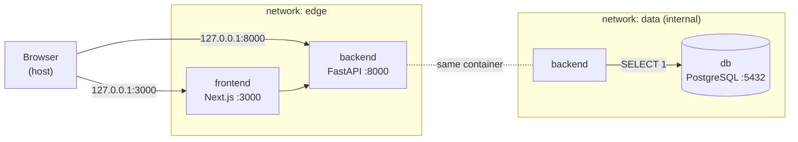
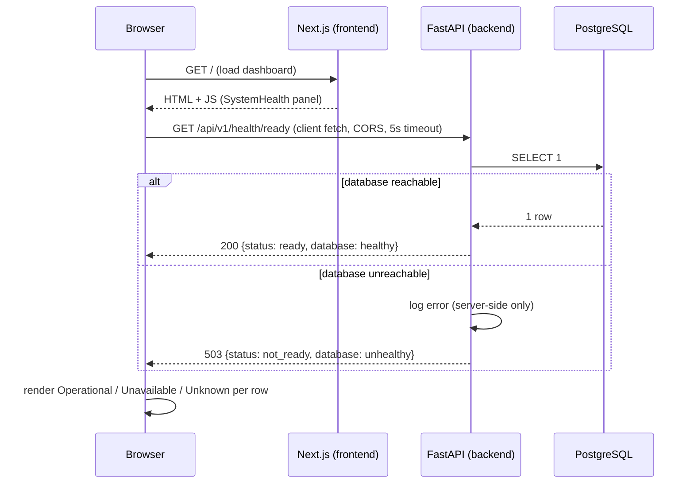

# InfraGuard AI - Architecture (v0.1)

> This document describes the **Project Bootstrap** (v0.1). It states what exists
> now and what is deliberately deferred. It is updated as phases land.
> **v0.1 is not production-ready.**

## 1. Project purpose

InfraGuard AI is an AI-powered infrastructure intelligence and incident
management platform. The long-term vision covers infrastructure asset
management, service and dependency modelling, incident management, health
monitoring, impact analysis, AI-assisted incident analysis, dependency graphs,
lifecycle and obsolescence management, and operational dashboards.

**v0.1 delivers none of that domain functionality.** It delivers a clean,
secure, reproducible foundation: a monorepo, a running frontend, a running
backend with real liveness/readiness probes, a containerised PostgreSQL,
dependency locking, container hardening, and CI that builds and smoke-tests
the stack.

## 2. Monorepo decision

A single repository holds the frontend, backend and infrastructure concerns.

**Why:** at this stage the services evolve together, share one environment
contract (`.env.example`), and are deployed as one local stack. A monorepo keeps
a single source of truth, atomic cross-cutting changes, and one place to reason
about security. Each concern is isolated in its own top-level directory with its
own build, dependencies and Dockerfile, so extraction later is cheap.

```
infraguard-ai/
├── frontend/     Next.js (App Router, TypeScript, Tailwind) + Vitest
├── backend/      FastAPI (Python 3.13, SQLAlchemy, Alembic) + hash-pinned locks
├── infra/        Placeholder for future IaC (k8s, Helm)
├── docs/         Architecture and design docs
├── .github/      CI: lint + tests + Docker smoke test
├── docker-compose.yml
├── .env.example
└── ...
```

## 3. Frontend architecture

- **Next.js App Router** with strict TypeScript (`strict`, `noUncheckedIndexedAccess`).
- **Tailwind CSS 3** for styling.
- **pnpm** (pinned via `packageManager: pnpm@11.24.0`).
- **ESLint 9 flat config** (`eslint.config.mjs`, run as `eslint .` - not the
  deprecated `next lint`).
- **Vitest + Testing Library** for behavior-focused unit tests.

```
frontend/src/
├── app/          Routes, layout, global styles (App Router)
│   └── healthz/  Route handler returning exactly HTTP 200 (frontend liveness)
├── components/   SystemHealth panel (client component) + tests
├── lib/          Client config (reads NEXT_PUBLIC_API_URL)
├── services/     API access layer (fetchBackendHealth) + tests
└── types/        Shared types + runtime type guards + tests
```

The landing/dashboard page shows the platform name, tagline, and a **System
health** panel with three rows: Frontend, Backend API, PostgreSQL Database.

- **Frontend** is reported operational because the page rendered in the browser.
- **Backend API** and **PostgreSQL Database** status come *only* from calling the
  backend **readiness** endpoint (`GET /api/v1/health/ready`) - never hardcoded.
- The service layer never throws: timeout, connection failure, unexpected HTTP
  status, non-JSON body and unexpected JSON shape each map to an explicit UI
  state (loading / operational / unavailable / unknown). A **Refresh** button
  re-queries. All of this is covered by Vitest tests.
- Only `NEXT_PUBLIC_API_URL` is read on the client. No secret is exposed through
  a `NEXT_PUBLIC_*` variable.

## 4. Backend architecture

- **FastAPI** + **Pydantic v2**, **SQLAlchemy 2** (sync engine), **Alembic**.
- **Python 3.13**, typed where it adds value.
- Layered structure:

```
backend/app/
├── api/v1/        HTTP layer, versioned under /api/v1
│   └── routes/    One module per resource (health)
├── core/          config.py - single Settings object (pydantic-settings)
├── db/            engine + SessionLocal + DeclarativeBase
├── models/        ORM models (empty in v0.1)
├── schemas/       Pydantic response models (Liveness / Readiness / Health)
└── services/      Domain logic (health checks)
```

### API

| Method | Path | Description | Codes |
| --- | --- | --- | --- |
| `GET` | `/api/v1/health/live` | Liveness - process is up. No DB access. | `200` |
| `GET` | `/api/v1/health/ready` | Readiness - live `SELECT 1`. | `200` / `503` |
| `GET` | `/api/v1/health` | Summarized status (`healthy`/`degraded`). Compatibility alias. | `200` / `503` |
| `GET` | `/docs`, `/openapi.json` | Swagger UI / OpenAPI schema | `200` |
| `GET` | `/` | Minimal service metadata | `200` |

`GET /api/v1/health/ready` returns:

```json
{ "status": "ready", "service": "infraguard-api", "database": "healthy" }
```

- HTTP **200** when the database round-trips a `SELECT 1`.
- HTTP **503** with `{"status": "not_ready", "database": "unhealthy"}` when it
  does not. Connection errors are logged server-side only; the response carries
  no stack trace, connection string or credentials.
- The `503` response is documented in OpenAPI with the **same** schema as `200`.

### `.env` resolution

`app/core/config.py` resolves `.env` by **absolute path** - the repository root
first, then `backend/.env` - never relative to the current working directory.
`cd backend && uvicorn ...` and running from the repo root behave identically.
Explicit environment variables always take precedence over `.env`
(init args > environment > `.env` > defaults). Docker injects plain environment
variables, so no `.env` file is present in (or needed by) any image.

`extra="forbid"` is intentionally **not** used: the repo-root `.env` is shared
with the frontend and container runtimes inject unrelated variables. Unknown
keys are ignored; safety is enforced by targeted validators instead.

### Production fail-safety

When `ENVIRONMENT=production`, `Settings` refuses to build (raises
`ConfigurationError`, no secrets in the message) if:

- the DB password is a well-known placeholder/default, or < 12 chars;
- the DB user is a placeholder/default (when the URL is assembled from parts);
- `BACKEND_CORS_ORIGINS` contains `*`, or is empty.

Development and test environments keep the convenient placeholder defaults.

## 5. PostgreSQL role

PostgreSQL is the platform's relational store. In v0.1 it runs **only** as a
Docker container (never installed on the host), on an **internal** network with
no host port and no outbound internet route. The backend uses a bounded
connection pool (`pool_pre_ping=True`, connect timeout). The schema is
intentionally empty - **no domain tables are created** in v0.1. Alembic is wired
and ready for the first real migration.

### Migrations

`alembic/env.py` imports `app.core.config` and `app.db.base:Base`, so the
database URL and metadata come from the one central place - credentials are
never copied into Alembic files.

```bash
alembic revision --autogenerate -m "add <table>"
alembic upgrade head
# in Docker: docker compose exec backend alembic upgrade head
```

## 6. Docker Compose architecture

### Network segmentation (least privilege)



| Service | Networks | Rationale |
| --- | --- | --- |
| `frontend` | `edge` only | Must reach the backend; **must not** reach PostgreSQL. |
| `backend` | `edge` + `data` | The only bridge between the web tier and the data tier. |
| `db` | `data` only (`internal: true`) | Reachable only by the backend; no route to the internet. |

- `frontend` and `backend` publish ports bound to `127.0.0.1` only.
- `db` publishes **no** host port. Data persists in the `pgdata` named volume.
- Verified: `frontend → db:5432` times out; `backend → db:5432` connects.

### Container hardening (defense in depth)

| Control | frontend | backend | db |
| --- | --- | --- | --- |
| Non-root user | `node` (1000) | `app` (999) | `postgres` |
| `no-new-privileges` | yes | yes | yes |
| `cap_drop: ALL` | yes | yes | yes (then `cap_add` the 5 the entrypoint needs) |
| Read-only root FS | yes | yes | no (PostgreSQL writes widely; data is a volume) |
| `tmpfs` writable paths | `/tmp`, `/app/.next/cache` | `/tmp` | `/tmp`, `/run/postgresql` |

Base images are pinned by **digest**; the readable tag is kept in a comment next
to it. Backend dependencies install from a hash-verified wheelhouse with no
network access at install time.

### Startup ordering

Health-gated `depends_on`:

```
db healthy ──▶ backend starts ──▶ backend LIVE (process up) ──▶ frontend starts
```

The backend container `HEALTHCHECK` is **liveness only**. The frontend therefore
starts as soon as the API process is up - even if PostgreSQL is unavailable -
and reports database degradation in its UI rather than failing to load.

## 7. Request flow



Conceptually:

```
Browser → Next.js → FastAPI → PostgreSQL
```

## 8. Liveness vs readiness

| Probe | Endpoint | Checks | Used by |
| --- | --- | --- | --- |
| **Liveness** | `/api/v1/health/live` | FastAPI process responds. **No** dependencies. | Backend container `HEALTHCHECK`; Compose `depends_on` gate for the frontend; (future) k8s `livenessProbe`. |
| **Readiness** | `/api/v1/health/ready` | Liveness **+** live PostgreSQL `SELECT 1`. | Frontend dashboard; (future) k8s `readinessProbe` / load-balancer gating. |
| **Summary** | `/api/v1/health` | Same as readiness, `healthy`/`degraded` wording. | Backwards compatibility / humans. |

The frontend container has its own liveness route, `GET /healthz`, returning
exactly `200` - it never contacts the backend or the database.

Health-check flow for the dashboard rows:

| Component | How its status is determined |
| --- | --- |
| Frontend | The dashboard rendered in the browser. |
| Backend API | The client's `GET /api/v1/health/ready` returned a well-formed response. |
| PostgreSQL | The `database` field of that response, set by a live `SELECT 1`. |

## 9. Security considerations (v0.1)

| Concern | Handling in v0.1 |
| --- | --- |
| Secrets | Never hardcoded. `.env` git-ignored; only `.env.example` (placeholders) tracked. No secret baked into any image. PowerShell/OS artifacts git-ignored. |
| Production config | Fail-fast: placeholder/short DB passwords, default DB user, and wildcard CORS are rejected when `ENVIRONMENT=production`. |
| CORS | Restricted to the configured local frontend origin. No wildcard. Credentials disabled. |
| Network | Segmented `edge` / `data` (internal) networks; frontend cannot reach the DB; DB has no outbound route. |
| DB exposure | No host port for PostgreSQL. App ports bound to `127.0.0.1`. |
| Error leakage | Health/readiness return generic states; details logged server-side only. `redoc` disabled. |
| Containers | Digest-pinned official base images, slim/alpine, non-root, `no-new-privileges`, `cap_drop: ALL`, read-only root FS (apps), `.dockerignore`, no `.env` copied in. |
| Dependencies | Backend: hash-pinned locks + pinned build tooling, installed offline in Docker. Frontend: `pnpm-lock.yaml`. |
| CI | Minimal `contents: read` token; actions pinned to commit SHAs; builds and smoke-tests the stack. |
| Auth / rate limiting | **Intentionally not implemented yet** - later phases. |

## 10. Dependency & image reproducibility

- **Backend abstract deps:** `pyproject.toml` (`==` pins). Build backend pinned
  in `[build-system]` (`setuptools`, `wheel`).
- **Backend resolved deps:** `requirements.txt` / `requirements-dev.txt`,
  generated by `pip-compile --generate-hashes`, committed. Every transitive
  dependency is pinned with a SHA-256 hash. Docker builds a wheelhouse with
  `pip wheel --require-hashes` then installs `--no-index` from it.
- **`pip` itself** is pinned in the Dockerfile and CI (no floating upgrade).
- **Frontend:** `pnpm-lock.yaml`; pnpm version pinned via `packageManager`.
- **Base images:** pinned by digest, readable tag in a comment. Update with
  `docker buildx imagetools inspect <image>:<tag>`.
- **GitHub Actions:** pinned to commit SHAs with `# vX.Y.Z` comments.

## 11. CI (v0.1 scope)

`.github/workflows/ci.yml`, triggered on PRs and pushes to `main`:

1. **backend** - install from the hash-pinned lock, `ruff check`, `pytest`.
2. **frontend** - `pnpm install --frozen-lockfile`, `lint`, `typecheck`,
   `test` (Vitest), `build`.
3. **docker-smoke** - `docker compose config`, `build`, `up -d`, wait for backend
   liveness, assert readiness `200`, assert frontend `/healthz` and `/` return
   `200`, dump logs on failure, `docker compose down -v` always.

Token permissions are `contents: read`. Out of scope for v0.1: image publishing,
deployment, Kubernetes, security scanning, release automation.

## 12. Future direction (NOT in v0.1)

Later, dedicated feature branches are expected to add:

- **Neo4j** for the infrastructure dependency graph
- **AI providers** for incident analysis / RAG
- **Kubernetes** manifests (`infra/k8s/`) and a **Helm** chart (`infra/helm/`),
  with Secrets / an external secret manager for credentials
- **CI/CD** pipelines (build, test, security scan, image publish, deploy)
- **Observability** (metrics, logs, traces)
- Authentication, authorization, rate limiting
- The InfraGuard domain model (assets, services, dependencies, incidents)

```mermaid
graph LR
    v01["v0.1<br/>Bootstrap"] --> auth["Auth & users"]
    auth --> domain["Domain model<br/>(assets, incidents)"]
    domain --> graph["Neo4j<br/>dependency graph"]
    domain --> ai["AI incident analysis"]
    domain --> k8s["Kubernetes + Helm"]
    k8s --> cicd["CI/CD + scanning"]
    k8s --> obs["Observability"]
```

The v0.1 boundary is deliberate: ship a trustworthy foundation first.
